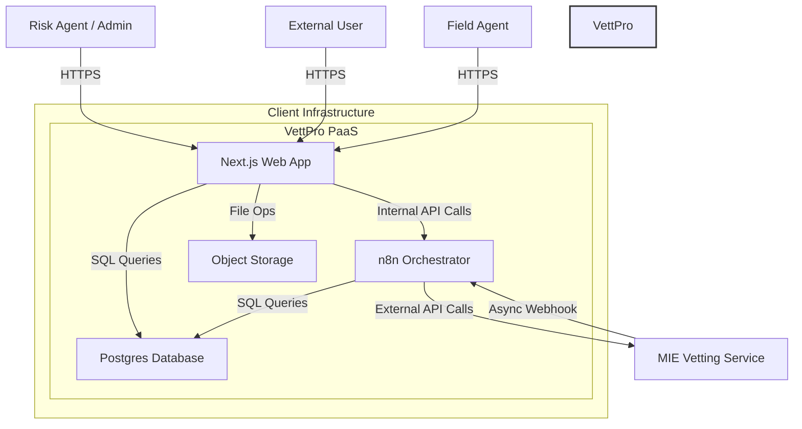
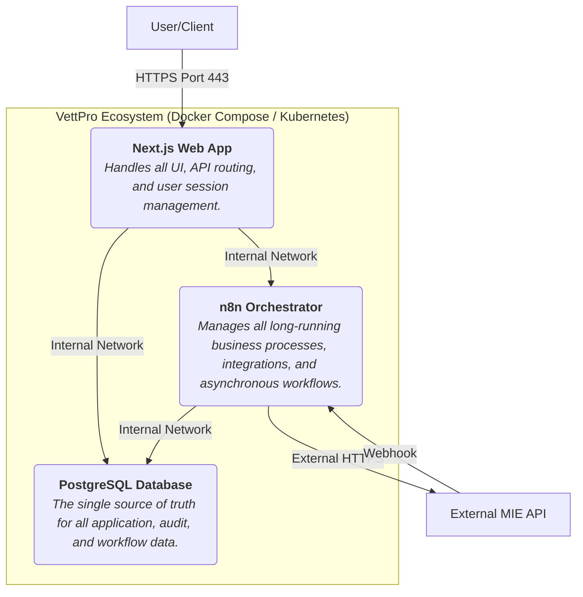

**VettPro Product Requirements Document (PRD) - Master Tracker**

| Section # | Section Title | Status | Notes |
| :--- | :--- | :--- | :--- |
| **Phase 1: Strategic Foundation** | | | |
| 1.0 | Introduction & Vision | 🟢 Approved | The "Why" behind the project. |
| 2.0 | User Personas & Scenarios | 🟢 Approved | The "Who" we are building for. |
| 3.0 | Full Product Scope & Core Capabilities | 🟢 Approved | The "What" we are building now. |
| **Phase 2: Feature Breakdown (The Core Product)** | | | |
| 4.1 | Epic: Core Platform & Auth | 🟢 Approved | User login, roles, main dashboard. |
| 4.2 | Epic: Company Pre-Vetting Workflow | 🟢 Approved | End-to-end user story breakdown. |
| 4.3 | Epic: Digital & Manual Consent | 🟢 Approved | Signature canvas, PDF uploads. |
| 4.4 | Epic: Admin Audit & Reporting | 🟢 Approved | Read-only audit trail UI. |
| 4.5 | Epic: Continuous Post-Vetting Workflow | 🟢 Approved | Ongoing supplier risk management. |
| 4.6 | Epic: RFP & Invoice Fraud Detection | 🟢 Approved | "Invoice DNA" and anomaly detection. |
| 4.7 | Epic: Field Agent PWA & Operations | 🟢 Approved | Offline-first PWA for on-site tasks. |
| 4.8 | Epic: AI-Powered Intelligence & Rules Engine| 🟢 Approved | User-configurable rules and insights. |
| **Phase 3: The Engineering & Security Blueprint** | | | |
| 5.0 | Technical Framework & Architecture | 🟢 Approved | C4 models, tech stack, key patterns. |
| 6.0 | Database & Schema Design | 🟢 Approved | Detailed `CREATE TABLE` statements. |
| 7.0 | API & Integration Contracts | 🟢 Approved | Endpoint definitions, webhook specs. |
| 8.0 | Security & Compliance by Design | 🟢 Approved | Actionable security requirements. |
| **Phase 4: Quality & Reference** | | | |
| 9.0 | Non-Functional Requirements (NFRs) | 🟢 Approved | Performance, availability, a11y. |
| 10.0 | Success Metrics | 🟢 Approved | How we measure success. |
| 11.0 | Glossary & Assumptions | 🟢 Approved | Defining our terms. |

*Status Key: 🔵 To-Do | 🟡 In Review | 🟢 Approved*

---
---

## 1.0 Introduction & Vision

### 1.1 Problem Statement

For large, highly regulated enterprises like ST-Mining, the process of vetting and managing suppliers, contractors, and employees is fraught with significant operational, financial, and compliance risks. The current landscape is characterized by:

*   **Fragmentation:** Critical data is scattered across disparate systems (ERP, standalone vetting providers, spreadsheets), leading to an incomplete and often contradictory view of an entity's risk profile.
*   **Manual Inefficiency:** Vetting processes are heavily reliant on manual data entry, document chasing, and follow-ups, resulting in slow onboarding cycles, high administrative overhead, and a frustrating experience for both internal teams and external partners.
*   **Opaque Risk Assessment:** Risk is often assessed at a single point in time, with no mechanism for continuous monitoring. This creates blind spots where a previously compliant supplier can fall out of good standing without anyone knowing until it's too late.
*   **Elevated Fraud & Corruption Risk:** Without a unified, intelligent system to cross-reference data (e.g., invoices against RFP terms, director changes against company records), the organization is highly vulnerable to sophisticated fraud, price gouging, and corruption schemes.
*   **Compliance Burden:** Adhering to legal frameworks such as the Protection of Personal Information Act (POPIA) and fulfilling local economic development mandates is a complex, evidence-intensive task that is poorly served by manual processes.

In essence, the lack of a central nervous system for intelligence and risk management creates a reactive, inefficient, and high-risk operational environment.

### 1.2 Product Vision

The vision for VettPro is to create the definitive **AI-powered intelligence ecosystem for enterprise risk management**, delivered as a secure, single-tenant Platform-as-a-Service (PaaS) solution.

VettPro will serve as the **ultimate, immutable source of truth** for all entity vetting, risk, and compliance data. It will ingest information from any source, orchestrate complex workflows, and leverage AI to transform unstructured data into actionable intelligence. By providing a unified, real-time, and predictive view of risk, VettPro will empower organizations to make faster, smarter, and safer business decisions.

### 1.3 Core Business Goals

The development of VettPro is aimed at achieving specific, measurable business outcomes. The success of the platform will be evaluated against its ability to:

1.  **Drastically Reduce Onboarding & Vetting Time:**
    *   **Goal:** Reduce the end-to-end time required to vet and onboard a new supplier by at least **50%**.
    *   **Mechanism:** Automating data collection, orchestrating parallel checks, and streamlining the consent process.

2.  **Significantly Decrease Fraud & Financial Loss:**
    *   **Goal:** Decrease incidents of invoice fraud, budget overruns, and duplicate payments by **90%**.
    *   **Mechanism:** Implementing the "Invoice DNA" comparison engine and anomaly detection models that cross-reference financial documents against contracts and historical data.

3.  **Maximize Operational Automation:**
    *   **Goal:** Automate **80%** of the manual tasks currently performed by risk and compliance agents.
    *   **Mechanism:** Leveraging AI for unstructured data extraction (transforming PDFs/reports into structured data) and n8n for workflow orchestration.

4.  **Ensure Bulletproof Compliance & Auditability:**
    *   **Goal:** Provide a complete, searchable, and immutable audit trail for every action taken within the system, ensuring 100% compliance with POPIA and other regulatory requirements.
    *   **Mechanism:** Implementing a dedicated, secure audit log for all data access and modification events.

5.  **Enhance Strategic Decision-Making:**
    *   **Goal:** Transition the organization from a reactive to a predictive risk management posture.
    *   **Mechanism:** Providing a real-time risk scoring system and AI-driven insights that alert stakeholders to emerging threats before they materialize.

---

## 2.0 User Personas & Scenarios

Understanding the individuals who will interact with VettPro is fundamental to building an effective and user-centric platform. These personas represent the primary user groups, their motivations, their daily challenges, and what they need from VettPro to succeed.

### 2.1 The Risk Agent - "Sarah, the Investigator"

*   **Role:** A mid-level compliance or risk officer. Sarah is the primary day-to-day user of VettPro, responsible for executing vetting cases, analyzing reports, and managing supplier risk profiles.
*   **Demographics:** 30-45 years old, highly detail-oriented, tech-savvy but not a developer. Works under constant pressure to meet deadlines and ensure compliance.
*   **Goals & Motivations:**
    *   To complete vetting cases accurately and efficiently.
    *   To have all necessary information in one place to make informed decisions.
    *   To easily identify and escalate high-risk cases.
    *   To feel confident that she is not missing any critical information.
*   **Frustrations (Current State):**
    *   "I waste hours switching between our ERP, email, and three different vetting provider websites to track one case."
    *   "Chasing suppliers for consent documents is a full-time job in itself."
    *   "By the time I compile a report manually, the data is already a week old."
    *   "I'm terrified I'll miss a red flag buried in a 100-page PDF report."
*   **How VettPro Empowers Sarah:**
    *   VettPro provides a single dashboard showing the real-time status of all her active cases.
    *   The automated consent workflow frees her from manual follow-ups.
    *   AI-powered data extraction pulls key insights from long reports and presents them in a digestible summary.
    *   A clear, continuously updated risk score allows her to prioritize her workload effectively.
*   **Key Scenario:** Sarah is assigned a new company, "ABC Mining Supplies," for pre-vetting. She logs into VettPro, creates a new case, enters the company details, and clicks "Initiate." VettPro automatically sends a digital consent link to the supplier, triggers the initial CIPC and Bank checks with MIE via n8n, and updates the case dashboard to "Pending Consent." Sarah can now move to her next task, confident that VettPro is managing the process.

### 2.2 The Super Admin - "David, the Guardian"

*   **Role:** A senior IT or Security administrator. David is responsible for the overall health, configuration, security, and user management of the VettPro platform.
*   **Demographics:** 40-55 years old, methodical, security-conscious, and focused on system stability and compliance.
*   **Goals & Motivations:**
    *   To ensure the platform is secure, available, and performant.
    *   To manage user access according to the principle of least privilege.
    *   To produce compliance and audit reports quickly for internal and external auditors.
    *   To configure the system (e.g., risk rules, integrations) without needing developer intervention.
*   **Frustrations (Current State):**
    *   "Onboarding a new risk agent requires me to set up accounts in four different systems."
    *   "When auditors ask for 'all actions related to supplier X,' it takes me two weeks to pull logs from everywhere."
    *   "There's no central control over what data users can see or export, which is a massive security risk."
*   **How VettPro Empowers David:**
    *   A centralized User Management interface allows him to create users and assign granular roles (RBAC) in one place.
    *   The immutable `audit.logs` schema and a searchable "Audit Trail" UI let him generate comprehensive reports in minutes, not weeks.
    *   He can manage API keys for integrations and configure system settings from a secure admin panel.
*   **Key Scenario:** An external auditor requests a log of all activities related to a high-profile supplier that was recently offboarded. David logs into VettPro, navigates to the "Audit Trail" section, filters by the supplier's name and a date range, and exports the complete, timestamped log as a PDF. The entire process takes less than five minutes.

### 2.3 The Field Agent - "Themba, the Verifier"

*   **Role:** An external contractor or internal employee responsible for on-the-ground physical verification tasks.
*   **Demographics:** 25-50 years old, mobile-first, practical. Operates in diverse environments, from urban offices to remote mining sites with intermittent internet connectivity.
*   **Goals & Motivations:**
    *   To have a clear list of daily verification jobs.
    *   To easily capture evidence (photos, notes, GPS coordinates).
    *   To submit reports with minimal fuss, even when offline.
*   **Frustrations (Current State):**
    *   "I have to print out job cards for the day because I lose signal at most sites."
    *   "I take photos on my phone, then have to drive back to the office to upload them and email my report. It wastes half my day."
    *   "Sometimes I fill out the wrong paper form for a job."
*   **How VettPro Empowers Themba:**
    *   The VettPro Field Agent Web App (PWA) on his phone provides a queue of his assigned jobs.
    *   The app is offline-capable. He can load his jobs in the morning, complete the forms, and take photos directly within the app all day without a connection.
    *   As soon as his phone reconnects to the internet (e.g., back in town), the app automatically syncs all his completed jobs and evidence in the background.
*   **Key Scenario:** Themba is tasked with verifying the physical address of a new supplier. He navigates to the site using the map in the app. Once there, he opens the correct verification form (pre-loaded), takes time-stamped photos of the premises, captures the GPS coordinates with one tap, and gets a digital signature from the site manager, all within the app. He marks the job as complete and moves on, knowing the data will sync automatically later.

### 2.4 The External User - "Jabu, the Supplier"

*   **Role:** A contact person at a supplier company or a staff member undergoing vetting. This is a one-time or infrequent user.
*   **Demographics:** Any age, diverse technical skills.
*   **Goals & Motivations:**
    *   To understand what is being asked of them.
    *   To complete the required action (e.g., give consent, upload a document) as quickly and easily as possible.
    *   To trust that the process is secure and their data is safe.
*   **Frustrations (Current State):**
    *   "They sent me a 10-page form to print, sign, scan, and email back. I don't have a scanner!"
    *   "I'm not sure if my documents were received or if they are just lost in someone's inbox."
*   **How VettPro Empowers Jabu:**
    *   He receives an email with a single, secure link.
    *   The link opens a clean, simple, mobile-friendly webpage branded with the ST-Mining logo.
    *   He can provide his consent with a quick signature directly on the screen with his finger or mouse.
    *   Upon submission, he receives an instant confirmation message: "Thank you. Your consent has been securely submitted."
*   **Key Scenario:** Jabu, the director of ABC Mining Supplies, receives an email requesting his consent for a background check. He clicks the link on his phone, which opens a page explaining the request. He draws his signature on the screen, clicks "Submit," and is done in under 60 seconds.

---

## 3.0 Full Product Scope & Core Capabilities

This section provides the definitive, holistic scope of the VettPro platform. Its purpose is to ensure the development team has absolute clarity on the complete vision. All features and capabilities listed herein are considered in scope for the final product and will be detailed in the subsequent sections of this document.

#### 3.1 Guiding Principles
*   **Holistic Vision:** This PRD describes the end-state system. All features are interconnected and contribute to the unified intelligence ecosystem.
*   **Decisive & Absolute:** The requirements detailed in this document are the single source of truth for development.
*   **Foundation for Excellence:** Every component will be architected to support the full feature set, ensuring scalability, security, and resilience from day one.

#### 3.2 Core Capabilities (Full Scope)
The following high-level capabilities constitute the complete scope for the VettPro platform.

##### 3.2.1 Core Platform & Intelligence Engine
*   **Deployment Architecture:** A containerized, single-tenant PaaS application designed for High Availability (HA) and with a formal Disaster Recovery (DR) strategy.
*   **Authentication & Roles (RBAC):** A comprehensive authentication system supporting granular roles, including but not limited to: Super Admin, Risk Agent, and Field Agent.
*   **AI-Powered Data Extraction:** An "Unstructured-to-JSON" engine capable of processing documents (e.g., PDF reports) and extracting structured data using LLMs.
*   **Predictive Risk Engine:** An AI-driven system for continuous risk scoring and anomaly detection.
*   **Business Rules Engine:** A user-facing UI for Super Admins to configure and manage business and risk rules that influence workflows and scoring.

##### 3.2.2 Vetting & Risk Management Workflows
*   **Company Pre-Vetting:** The complete, end-to-end workflow for vetting new companies.
*   **Employee Vetting:** The complete, end-to-end workflow for vetting employees and contractors.
*   **Continuous Post-Vetting:** An automated workflow for periodically re-vetting entities and monitoring for changes in their risk profile.

##### 3.2.3 Financial & RFP Analysis
*   **RFP Analysis Module:** A feature set for analyzing Request for Proposal documents.
*   **"Invoice DNA" Comparison Engine:** An advanced module for detecting fraud by comparing invoices against RFPs, purchase orders, and historical data.

##### 3.2.4 Consent & Field Operations
*   **Unified Consent Management:** A seamless workflow supporting both on-screen digital signatures and manual (PDF upload) consent processes.
*   **Field Agent Operations:** A dedicated, offline-capable Progressive Web App (PWA) for field agents to perform on-site verification tasks.

##### 3.2.5 Integrations
*   **Vetting Providers:** A pluggable architecture to support multiple vetting providers, with MIE being the initial integration.
*   **ERP Integration:** Full, bi-directional integration capabilities with enterprise ERP systems.

##### 3.2.6 Security & Compliance
*   **Advanced Secrets Management:** Integration with a dedicated secrets management solution (e.g., HashiCorp Vault or a cloud-native KMS) for all API keys, database credentials, and other secrets.
*   **Comprehensive Audit Trail:** A searchable, user-facing "Audit Trail" UI built on top of the immutable `audit.logs` database schema, allowing for full traceability of all actions.
*   **Full Compliance:** The platform will be built to satisfy all requirements outlined in the DPA and Technical Security Questionnaire (TSQ).

---

### 4.0 Feature Requirements & Acceptance Criteria

This is the heart of the PRD. This breaks down the capabilities into specific, testable features. Each feature should follow a strict template.
Each of the core capabilities listed in Section 3.0 will be broken down into a dedicated "Epic" section below (4.1, 4.2, etc.).

#### **4.1 Epic: Core Platform & Auth**

This epic covers the foundational elements required for any user to securely interact with the VettPro platform. It includes user authentication, role-based access control, and the main application dashboard.

#### Feature 4.1.1: Secure User Authentication with Passwords

*   **User Stories:**
    *   As Sarah the Risk Agent, I want to log in with my company email and a secure password that I manage, so that I can confidently access my work and trust that the system is secure.
    *   As David the Super Admin, I want the login system to enforce strong password policies and protect against brute-force attacks to safeguard sensitive company data and maintain system integrity.
*   **Acceptance Criteria:**
    1.  The platform **must** implement a robust, industry-standard authentication strategy using `NextAuth.js` with the `CredentialsProvider`.
    2.  The login mechanism **must** support email and password credentials. The login page **must** present input fields for both.
    3.  A strong password policy **must** be enforced on user creation and password reset. The UI must provide real-time feedback on these requirements:
        *   Minimum 12 characters.
        *   At least one uppercase letter.
        *   At least one lowercase letter.
        *   At least one number.
        *   At least one special character (e.g., `!@#$%^&*`).
    4.  Passwords **must** be stored in the database using a strong, salted, one-way hashing algorithm like `Argon2` or `bcrypt`. Plaintext passwords must never be stored.
    5.  Brute-force attack protection **must** be implemented: after 5 consecutive failed login attempts for a single account, that account **must** be locked for a period of 15 minutes. The user must be notified of the lockout.
    6.  Session management **must** be secure, utilizing HttpOnly cookies to store session tokens and prevent XSS attacks. The strategy will employ short-lived access tokens and long-lived, securely stored refresh tokens.
    7.  A "Forgot Password" flow **must** be available on the login page. This flow must:
        *   Prompt the user for their email address.
        *   Send a secure, time-limited (e.g., 60 minutes), single-use password reset link to the registered email address.
        *   The link must lead to a page where the user can set a new password that adheres to the strong password policy.
*   **UX/UI Notes:**
    *   A clean, professional login page will be presented, featuring input fields for email and password.
    *   Clear, user-friendly error messages will be displayed for incorrect credentials ("Invalid email or password"), locked accounts, or other login issues. Error messages should not reveal whether a username exists or not to prevent user enumeration.
    *   The password input field must have a toggle icon to show/hide the entered text.
*   **Technical Notes:**
    *   `NextAuth.js` with the `CredentialsProvider` is the recommended implementation.
    *   Password reset tokens must be cryptographically random, stored hashed in the database (e.g., in a `main.password_reset_tokens` table), and invalidated immediately after use or expiration.
    *   An email sending service (e.g., Amazon SES, SendGrid) is required for the password reset functionality.

#### **Feature 4.1.2: Role-Based Access Control (RBAC)**
*   **User Stories:**
    *   As David the Super Admin, I need to assign specific roles to users during account creation and be able to modify them later, so that I can precisely control access to features and data according to the principle of least privilege.
    *   As Sarah the Risk Agent, I expect to be prevented from accessing administrative sections of the application, so that I can focus on my work without the risk of accidentally altering critical system configurations.
*   **Acceptance Criteria:**
    1.  The system **must** define at least three distinct roles: `SUPER_ADMIN`, `RISK_AGENT`, `FIELD_AGENT`.
    2.  Permissions **must** be enforced at both the UI level (e.g., hiding navigation links, disabling buttons) and, critically, at the API level (e.g., API routes must reject requests from users with insufficient permissions).
    3.  A user with the `SUPER_ADMIN` role **must** have access to a "User Management" section.
    4.  Within User Management, a `SUPER_ADMIN` **must** be able to perform full CRUD operations: Create new users, View a list of all users, Update user details (name, roles, status), and Deactivate/Reactivate users.
    5.  Users with the `RISK_AGENT` or `FIELD_AGENT` roles **must** receive a `403 Forbidden` error if they attempt to access an admin-only API endpoint directly.
*   **UX/UI Notes:**
    *   The "User Management" area will feature a data table displaying all users with columns for Name, Email, Assigned Roles, and Status (e.g., 'Active', 'Inactive').
    *   The table must support sorting and filtering.
    *   Creating or editing a user will open a modal or a dedicated page where the Super Admin can input user details and assign roles via a multi-select dropdown or a list of checkboxes.
*   **Technical Notes:**
    *   User roles must be encoded into the session JWT upon login to allow for stateless and efficient permission checking in server-side logic and API middleware.
    *   A dedicated API middleware function must be created and applied to all relevant API routes to validate the user's role(s) against the required permission for that endpoint.

#### **Feature 4.1.3: Main Application Dashboard**
*   **User Stories:**
    *   As Sarah the Risk Agent, when I log in, I want to immediately see a high-level summary of my current workload and any urgent items, so I can prioritize my day's work effectively without having to navigate to multiple pages.
    *   As David the Super Admin, upon logging in, I want to see a snapshot of key system health and user activity metrics so that I can quickly assess the platform's operational status and spot potential issues.
*   **Acceptance Criteria:**
    1.  The dashboard **must** be the default page presented to a user immediately after successful login.
    2.  The content and layout of the dashboard widgets **must** be conditional based on the logged-in user's role.
    3.  **For `RISK_AGENT` roles:**
        *   The dashboard **must** display a "My Active Cases" widget showing a numerical count of cases assigned to them, broken down by status (e.g., `Pending Consent`, `In Progress`, `Requires Review`).
        *   It **must** display a list of their 5 most recently updated cases, with each item being a clickable link that navigates to that case's detail page.
    4.  **For `SUPER_ADMIN` roles:**
        *   The dashboard **must** display a "System Health" widget indicating the status of critical components (e.g., Database Connection: OK, n8n Workflow Health: OK, Last Backup: Success).
        *   It **must** display a "User Activity" widget showing metrics like "Users Online" and "New Users (Last 7 Days)".
*   **UX/UI Notes:**
    *   The dashboard will utilize a modern, card-based layout for displaying widgets.
    *   Each widget will have a clear title and present data in a visually digestible format (e.g., large numbers, simple lists).
    *   The dashboard must feel responsive and load quickly. Skeleton loaders or similar placeholders must be used while data is being fetched to provide a smooth user experience.
*   **Technical Notes:**
    *   The dashboard page should be server-side rendered (SSR) or use Incremental Static Regeneration (ISR) to ensure the data is fresh upon visit without sacrificing performance.
    *   A set of role-specific API endpoints will be created to supply the data for the dashboard widgets (e.g., `GET /api/dashboard/agent-summary`, `GET /api/dashboard/admin-summary`). These endpoints must be protected by the RBAC middleware.

### 4.2 Epic: Company Pre-Vetting Workflow

This epic details the core end-to-end process for vetting a new company. It is the primary value-delivery mechanism of the VettPro platform, orchestrating data input, external integrations, and results presentation.

#### **Feature 4.2.1: Initiate New Vetting Case**
*   **User Story:** As Sarah the Risk Agent, I need to be able to quickly and easily initiate a new vetting case for a company by providing its essential details, so that the automated vetting process can begin without delay.
*   **Acceptance Criteria:**
    1.  A dedicated "Initiate Vetting" page **must** exist, accessible to `RISK_AGENT` and `SUPER_ADMIN` roles.
    2.  The page **must** present a form with the following required fields for the company being vetted:
        *   Company Name (Text)
        *   Trading Name (Text, optional)
        *   Company Registration Number (Text, with validation for South African format YYYY/NNNNNN/07)
        *   Primary Contact Email (Text, with email format validation)
        *   Primary Contact Name (Text)
    3.  Upon submission, the form data **must** be validated on the server.
    4.  On successful validation, a new record **must** be created in the `main.vetting_cases` table with a status of `INITIATED`.
    5.  The creation of the case **must** trigger a server-side process to dispatch a job to the n8n workflow responsible for the pre-vetting orchestration.
    6.  After successful submission, the user **must** be redirected to the "Case Detail View" for the newly created case.
    7.  A success toast notification (e.g., using `sonner`) **must** be displayed confirming "Case [Case ID] created successfully."
    8.  If form validation fails or the server returns an error, a user-friendly error message **must** be displayed.
*   **UX/UI Notes:**
    *   The form will be clean and uncluttered, with clear labels and placeholder text for each field.
    *   Real-time, client-side validation should provide immediate feedback on fields like email and registration number format.
    *   A "Submit" button will be disabled until all required fields are validly filled.
*   **Technical Notes:**
    *   A `POST /api/vetting/cases` endpoint will handle the form submission and case creation logic.
    *   This endpoint is responsible for creating the database record and triggering the initial n8n workflow.
    *   Input sanitization must be performed on the backend to prevent injection attacks.

#### **Feature 4.2.2: Vetting Case Detail View**
*   **User Story:** As Sarah the Risk Agent, I need a comprehensive, single-page view for each vetting case where I can track its real-time status, review all submitted information, and see the results of every individual check as they become available.
*   **Acceptance Criteria:**
    1.  A dynamic route (e.g., `/vetting/cases/[caseId]`) **must** exist to display the details of a specific case.
    2.  The page **must** be protected, accessible only to users with appropriate permissions.
    3.  A "Case Summary" panel **must** be prominently displayed, showing the core company details (Name, Reg Number) and the overall case status (e.g., `INITIATED`, `PENDING_CONSENT`, `CHECKS_IN_PROGRESS`, `REPORT_READY`).
    4.  A "Status Timeline" or "Stepper" component **must** visually represent the current stage of the case in the overall workflow.
    5.  A "Checks" tab/section **must** list all individual checks associated with this workflow (e.g., CIPC Verification, Bank Account Verification).
        *   Each check **must** display its own status (e.g., `Pending`, `In Progress`, `Complete`, `Error`).
        *   When results are available, they must be clearly displayed under the relevant check.
    6.  A "Documents" tab/section **must** exist to list and provide access to any documents related to the case, such as the uploaded consent form.
*   **UX/UI Notes:**
    *   The layout will be a multi-panel dashboard. A sticky header might contain the case summary and primary actions.
    *   The main content area will use tabs to organize detailed information, preventing clutter.
    *   Status badges will be color-coded (e.g., blue for in-progress, green for complete, red for error) for at-a-glance understanding.
*   **Technical Notes:**
    *   A `GET /api/vetting/cases/[caseId]` endpoint will fetch all data for the view, including the case details, associated checks, and documents. This should be a well-structured query to avoid multiple round trips.
    *   To provide real-time status updates without requiring page reloads, this page is a prime candidate for using WebSockets or Server-Sent Events (SSE) to push updates from the server as they happen (e.g., when an n8n webhook updates a check's status).

#### **Feature 4.2.3: Automated MIE Integration Workflow (n8n)**
*   **User Story:** As a System, once consent for a vetting case is confirmed, I must automatically trigger the MIE workflow to execute all required checks, receive the results asynchronously, and update the case status without any human intervention.
*   **Acceptance Criteria:**
    1.  The n8n workflow **must** be triggered when a case's status changes to `PENDING_CHECKS`.
    2.  The workflow **must** iterate through the required checks (initially CIPC and Bank Account) and make the appropriate API calls to MIE for each one.
    3.  The VettPro backend **must** expose a secure, unique webhook endpoint that n8n can provide to MIE for asynchronous result delivery. This endpoint must be capable of identifying the specific case and check the incoming result belongs to.
    4.  Upon successful dispatch of checks to MIE, the case status in the VettPro database **must** be updated to `CHECKS_IN_PROGRESS`.
    5.  When MIE calls the webhook with a check result, the backend **must**:
        *   Validate the incoming request (e.g., via a shared secret or signature).
        *   Parse the result data.
        *   Update the corresponding `vetting_checks` record in the database with the result and change its status to `COMPLETE`.
    6.  A separate process (or part of the n8n workflow) **must** monitor the case's checks. Once all required checks have a status of `COMPLETE`, the overall case status **must** be updated to `REPORT_READY`.
*   **UX/UI Notes:**
    *   This is a backend-heavy feature. Its success is measured by the accurate and timely reflection of status changes in the "Case Detail View" UI.
*   **Technical Notes:**
    *   The n8n workflow must be designed for resilience, with error handling and retry logic for API calls to MIE.
    *   The webhook endpoint (`POST /api/webhooks/mie`) must be robust and highly available. It should immediately respond with a `200 OK` and then process the data asynchronously in a background job to avoid keeping the MIE callback waiting.
    *   Database schema must include a `vetting_cases` table and a related `vetting_checks` table to track the status and results of each individual check.

#### **Feature 4.2.4: Consolidated Final Report**
*   **User Story:** As Sarah the Risk Agent, when a case is fully processed, I need the system to present a clean, consolidated report with a clear summary of all findings, so I can make a final vetting decision and share it with stakeholders.
*   **Acceptance Criteria:**
    1.  When a case's status is `REPORT_READY`, a "View Report" button **must** become visible and active on the "Case Detail View" page.
    2.  The report view **must** present a clean, print-friendly summary of the case's core details.
    3.  The report **must** clearly and concisely display the final result of each individual check (e.g., CIPC Status: `Verified`, Registered Directors: `[...]`; Bank Account: `Verified`).
    4.  The system **must** provide an option for the user to export or "Print to PDF" the final report.
*   **UX/UI Notes:**
    *   The report page will be designed with minimal UI chrome for clean printing.
    *   Clear visual cues (e.g., green checkmarks for "Verified", red flags for "Discrepancy") will be used to make the report easily scannable.
*   **Technical Notes:**
    *   PDF generation will be handled server-side for consistency and quality. A library like `Puppeteer` or `Playwright` can be used to render the HTML report page in a headless browser and save it as a PDF.

### 4.3 Epic: Digital & Manual Consent

This epic defines the critical workflows for obtaining and managing consent, a legal and procedural prerequisite for any vetting activity. It provides flexible mechanisms to handle both modern digital interactions and traditional paper-based processes, ensuring no case is blocked due to the supplier's technical limitations.

#### **Feature 4.3.1: Digital Consent Request & Capture**
*   **User Story:** As Sarah the Risk Agent, after initiating a case, I need to send a secure, single-use link to the supplier contact (Jabu), so they can provide their consent electronically, which should automatically advance the case to the next stage.
*   **Acceptance Criteria:**
    1.  From the "Case Detail View" (for a case with status `INITIATED`), a "Request Consent" button **must** be available.
    2.  Clicking this button **must** trigger a backend process to generate a unique, cryptographically secure, and time-limited token associated with this specific consent request.
    3.  The system **must** automatically send a pre-defined email template to the primary contact's email address. This email must contain the single-use link (e.g., `https://vettpro.ST-Mining.com/consent?token=...`).
    4.  The case status **must** be updated to `PENDING_CONSENT` in the database.
    5.  When the external user (Jabu) clicks the link, the system **must** validate the token. If valid and not expired, it must render a consent page. If invalid or expired, a clear error page must be shown.
    6.  The consent page **must** display the name of the company for which consent is requested.
    7.  A signature pad component (from `react-signature-canvas`) **must** be displayed, allowing the user to draw their signature. "Clear" and "Submit" buttons must be present.
    8.  The "Submit" button **must** be disabled until the user has drawn something on the signature pad.
    9.  Upon submission, the signature **must** be captured as a `base64` encoded PNG image string and sent to the VettPro backend.
    10. The backend (`POST /api/consent/[tokenId]`) **must** validate the token again, save the signature image to the designated object store (S3-compatible), and link the file's location to the case's document record.
    11. The consent token **must** be invalidated immediately after successful submission to prevent reuse.
    12. The case status **must** be updated to `PENDING_CHECKS`, which will trigger the MIE integration workflow (as defined in 4.2.3).
    13. The external user **must** be shown a success confirmation page after submission.
*   **UX/UI Notes:**
    *   The consent request email must be professionally formatted and clearly state the purpose of the request.
    *   The public-facing consent page will be clean, mobile-first, and branded with the client's logo to build trust.
    *   The signature pad must be responsive and work smoothly on both desktop (mouse) and mobile (touch).
*   **Technical Notes:**
    *   Consent tokens will be stored hashed in the database (`main.consent_requests` table) with an expiration timestamp (e.g., 72 hours).
    *   The object storage solution must be configurable (e.g., via environment variables) to point to the client's S3-compatible infrastructure.
    *   The endpoint receiving the signature must be hardened against abuse and not require authentication (as it's for external users), relying solely on the security of the single-use token.

#### **Feature 4.3.2: Manual Consent Upload & Bypass**
*   **User Story:** As Sarah the Risk Agent, if a supplier sends me a scanned, signed consent form via email, I need a way to upload that PDF directly to the case and manually confirm that consent has been provided, so the workflow can proceed without being blocked by the digital process.
*   **Acceptance Criteria:**
    1.  On the "Case Detail View" for a case in `PENDING_CONSENT` status, a "Upload Manual Consent" button **must** be available.
    2.  Clicking this button **must** open a file upload modal.
    3.  The modal **must** allow the agent to select and upload a single PDF file.
    4.  Client-side validation **must** restrict file types to PDF and enforce a reasonable size limit (e.g., 10MB).
    5.  Upon successful upload, the PDF **must** be sent to the backend, stored in the object store, and linked to the case's document record.
    6.  The modal **must** contain a checkbox: "I confirm that the uploaded document represents valid, signed consent from the entity." This checkbox must be checked to enable the final "Confirm & Proceed" button.
    7.  Upon confirmation, the system **must** update the case status to `PENDING_CHECKS`, effectively bypassing the digital flow and triggering the MIE integration.
    8.  The previously generated digital consent link (if any) **must** be programmatically invalidated.
*   **UX/UI Notes:**
    *   The upload modal will be simple, showing the file selector and a preview of the selected file's name.
    *   A progress indicator should be shown during the file upload.
    *   The confirmation checkbox serves as a deliberate action to prevent accidental bypass.
*   **Technical Notes:**
    *   A `POST /api/cases/[caseId]/manual-consent` endpoint will handle the file upload and status update. This endpoint must be protected by RBAC middleware.
    *   The system should use a multipart form data request to handle the file upload.
    *   The action of manually confirming consent must be recorded in the `audit.logs` table, capturing which agent performed the action and when.

#### **Feature 4.3.3: Consent Status Tracking & Visibility**
*   **User Story:** As Sarah the Risk Agent, I need to easily see the consent status of a case at a glance from my main dashboard and within the case view, so I can quickly identify which cases are stalled and require me to follow up with the supplier.
*   **Acceptance Criteria:**
    1.  The "Case Detail View" **must** clearly display the current consent status.
    2.  If digital consent has been requested, the view **must** show details like "Consent Requested On: [Date]" and "Link Expires: [Date/Time]".
    3.  A "Resend Request" button **must** be available, allowing the agent to send a new consent request email (which invalidates the old link and generates a new one). This action must be rate-limited to prevent spam.
    4.  If consent was provided manually, the view **must** show "Consent Provided Manually by [Agent Name] on [Date]" with a link to view the uploaded document.
*   **UX/UI Notes:**
    *   The consent status section will be a distinct card or panel within the case detail view.
    *   Actions like "Resend Request" will be clear buttons with confirmation dialogs.
*   **Technical Notes:**
    *   The `main.consent_requests` table will store the token, its status (`sent`, `submitted`, `expired`, `invalidated`), creation date, and expiration date, providing all necessary data for this feature.
    *   Resending the request creates a new token and updates the foreign key on the case, effectively orphaning the old request.

### 4.4 Epic: Admin Audit & Reporting

This epic addresses the critical requirement for comprehensive, accessible, and immutable audit logging. It provides the Super Admin (David) with the necessary tools to monitor system activity, investigate incidents, and fulfill compliance requests, thereby ensuring accountability and system integrity. This is the user-facing implementation of the logging mechanism established in the security requirements.

#### **Feature 4.4.1: Searchable Audit Trail UI**
*   **User Story:** As David the Super Admin, I need a powerful and intuitive interface to search, filter, and review the complete audit trail of all actions taken within the platform, so I can efficiently investigate security events, troubleshoot issues, and respond to compliance audits with confidence.
*   **Acceptance Criteria:**
    1.  A dedicated "Audit Logs" page **must** exist, accessible only to users with the `SUPER_ADMIN` role (e.g., at `/administration/audit-logs`).
    2.  The page **must** display audit logs in a clear, paginated data table format.
    3.  The data table **must** include the following sortable columns:
        *   `Timestamp`: The exact date and time the event occurred (ISO 8601 format).
        *   `User`: The name or email of the user who performed the action.
        *   `Action`: A human-readable representation of the event type (e.g., `USER_LOGIN_SUCCESS`, `CASE_CREATED`, `CONSENT_MANUALLY_UPLOADED`, `PASSWORD_RESET_FAILED`).
        *   `Target`: A reference to the entity that was affected (e.g., `Case ID: 12345`, `User: sarah@vettpro.com`).
        *   `Source IP`: The IP address from which the request originated.
    4.  The page **must** feature a comprehensive set of filtering controls:
        *   **Date Range:** Two date pickers to select a "Start Date" and "End Date".
        *   **User:** An auto-completing search box or dropdown to filter by a specific user.
        *   **Action Type:** A multi-select dropdown to filter by one or more action types.
        *   **Free Text Search:** A single search bar that queries across the `Target` and `Details` of the log entries.
    5.  The results in the data table **must** update in real-time as filters are applied.
    6.  An "Export to CSV" button **must** be available. Clicking this button must download a CSV file containing the data from the *currently filtered view* of the audit logs.
    7.  Each row in the table **must** be expandable to show a "Details" view, which displays the full JSONB payload associated with that log entry in a formatted, readable way.
*   **UX/UI Notes:**
    *   The filter controls will be positioned logically at the top of the page.
    *   The data table will be designed for clarity and performance, efficiently handling potentially millions of rows through server-side pagination.
    *   Applying filters should feel instantaneous, with a loading indicator showing that data is being fetched.
    *   The expanded "Details" view will use syntax highlighting for the JSON data to improve readability.
*   **Technical Notes:**
    *   A dedicated `GET /api/audit-logs` endpoint will be created to serve the data for this page. This endpoint must handle all filtering, sorting, and pagination logic on the server-side to ensure performance.
    *   Database queries to the `audit.logs` table must be highly optimized, with indexes on `timestamp`, `user_id`, and `action_type`.
    *   The CSV export functionality will be handled by the API, which will stream the file directly to the user to avoid high memory consumption on the server.

#### **Feature 4.4.2: Audit Log Immutability & Integrity**
*   **User Story:** As a System, I must ensure that once an audit log is written, it can never be altered or deleted through the application, thereby guaranteeing its integrity as a legal and factual record of events.
*   **Acceptance Criteria:**
    1.  All audit logs **must** be written to the `audit.logs` table located within the dedicated `audit` database schema.
    2.  The application's primary database user role **must** be configured at the database level with permissions that explicitly **forbid** `UPDATE` or `DELETE` operations on the `audit.logs` table. The role should only be granted `INSERT` and `SELECT` privileges on this table.
    3.  There **must not** be any API endpoint exposed by the application that allows for the modification or deletion of audit log records. Any such attempt from the client should be rejected.
    4.  Each log record **must** atomically capture a comprehensive set of data points for every event, including:
        *   A unique, sequential ID (`BIGSERIAL`).
        *   `timestamp` (with timezone).
        *   `user_id` (foreign key to the users table).
        *   `action_type` (a standardized enum value).
        *   `target_entity_type` (e.g., 'Case', 'User').
        *   `target_entity_id`.
        *   `details` (a `JSONB` field containing rich contextual data, such as the `before` and `after` state of a modified record).
        *   `source_ip_address`.
*   **UX/UI Notes:**
    *   This is a non-functional, backend, and database architecture feature. Its success is measured by the complete inability of any application user, including a Super Admin, to modify the audit trail through the UI.
*   **Technical Notes:**
    *   A database migration script will be responsible for creating the `audit` schema, the `audit.logs` table, and setting the specific, restrictive permissions for the application's user role.
    *   A centralized logging service/function within the application backend should be used to generate and insert log records. This ensures all logs have a consistent structure and that the logging logic is not scattered throughout the codebase.

---

#### **4.5 Epic: Continuous Post-Vetting Workflow**

This epic covers the critical capability of ongoing supplier risk management. It moves beyond a one-time pre-vetting check to establish a configurable, automated system for continuous monitoring based on pre-defined risk tiers.

**Feature 4.5.1: Admin Schedule Configuration**
*   **User Story:** As a Super Admin, I want to configure the re-vetting frequency for different supplier risk tiers so that we can automate continuous monitoring according to our internal risk policy.
*   **Acceptance Criteria:**
    1.  A new page/modal must be available in the Admin section titled "Post-Vetting Schedule."
    2.  This interface must present a form where the admin can map a 'Risk Tier' (`Low`, `Medium`, `High`, `Critical`) to a re-vetting 'Frequency' (`3 months`, `6 months`, `12 months`, `24 months`).
    3.  The form must show the current saved schedule when loaded.
    4.  Saving the configuration must successfully update or create entries in a `main.post_vetting_schedules` table, storing the `risk_tier` and `frequency_in_months`.
*   **Technical Notes:**
    *   The frontend will call a new `POST /api/admin/schedules/post-vetting` endpoint.
    *   The backend will perform validation to ensure frequencies are valid integer values.
    *   A new table `main.post_vetting_schedules` will be required: `(risk_tier TEXT PRIMARY KEY, frequency_in_months INTEGER NOT NULL)`.

**Feature 4.5.2: Automated Post-Vetting Job Creation**
*   **User Story:** As a system, I want to automatically scan all `active`, `compliant` suppliers on a daily basis and create new `post_vetting` cases for those whose re-vetting date has come due, so that no supplier misses their scheduled check.
*   **Acceptance Criteria:**
    1.  A daily cron job must be configured to run at a low-traffic time (e.g., 01:00 AM server time).
    2.  The job must fetch all suppliers from `main.suppliers` with `status = 'active'` and `compliance_status = 'compliant'`.
    3.  For each supplier, the job must look up their `risk_tier`, find the corresponding `frequency_in_months` from `main.post_vetting_schedules`, and calculate the next vetting date based on the `completed_at` timestamp of their last `completed` vetting case.
    4.  If `NOW() >= last_vetting_date + frequency`, a new record must be inserted into `main.vetting_cases`.
    5.  The new case **must** have its `case_type` set to `'post_vetting'`.
    6.  The new case **must** have a `parent_case_id` column populated with the ID of the original vetting case to maintain a historical link.
*   **Technical Notes:**
    *   This logic will be implemented as a dedicated n8n workflow triggered by a cron node.
    *   The `main.vetting_cases` table will need a new nullable column `parent_case_id UUID REFERENCES main.vetting_cases(id)`.

**Feature 4.5.3: Post-Vetting Case Management**
*   **User Story:** As Sarah the Risk Agent, I want post_vetting cases to appear in my main 'Active Cases' list, clearly marked, so I can manage them using the same workflow and tools as my pre_vetting cases.
*   **User Story:** As a Risk Agent, I want to see and manage `post_vetting` cases in the same way I manage `pre_vetting` cases, so that I can follow a consistent workflow for all vetting activities.
*   **Acceptance Criteria:**
    1.  The "Active Vetting Cases" table UI must now include a "Case Type" column showing "Pre-Vetting" or "Post-Vetting".
    2.  Filtering options must be added to the UI to allow agents to view all cases, or only pre-vetting or post-vetting cases.
    3.  All subsequent workflows (consent, checks, reporting) must function identically for post-vetting cases as they do for pre-vetting cases.
*   **Technical Notes:**
    *   The `GET /api/vetting/cases` endpoint will need a new optional query parameter: `caseType`.
    *   Frontend state management will need to handle the new filter.

**Feature 4.5.4: Risk Score Change Alerting**
*   **User Story:** As a Risk Agent, I want to be immediately notified if a post-vetting check results in a significant change to a supplier's risk score, so that I can take immediate action.
*   **Acceptance Criteria:**
    1.  When a `post_vetting` case is `Completed`, the system must compare the new `final_risk_score` with the `final_risk_score` of the `parent_case_id`.
    2.  If the score changes by more than a configurable threshold (e.g., 20%), a new `risk_event` must be logged in the `main.risk_events` table.
    3.  The event description should clearly state the old score and the new score.
    4.  An email notification must be sent to the assigned Risk Agent and their manager.
*   **Technical Notes:**
    *   This logic should be encapsulated in an n8n workflow triggered when a case's status is updated to `Completed` and its `case_type` is `post_vetting`.
    *   This will require a new table `main.system_configurations` with a key-value store approach, or a new UI in the Admin panel under 'Post-Vetting Configuration' to set the `risk_score_alert_threshold` value.


#### **4.6 Epic: Project-Based Vetting Campaigns**

This epic addresses the critical need for proactive, targeted vetting initiatives. It introduces the concept of a "Project" as a container for managing batch-vetting campaigns, moving the platform beyond single-case initiation into strategic risk management. This allows Risk Agents like Sarah to define a specific cohort of suppliers based on rich criteria and execute a standardized set of checks against them intelligently.

**Feature 4.6.1: Project Creation Wizard**
*   **User Story:** As Sarah the Risk Agent, I want to create a new "Vetting Project" using a guided wizard, so I can define a targeted campaign, build a specific cohort of suppliers using advanced filters, and select the exact checks to be performed on the entire batch.
*   **Acceptance Criteria:**
    1.  A new top-level menu item, "Vetting Projects," **must** exist, leading to a project list page (`/vetting/projects`).
    2.  This page **must** have a "Create New Project" button that launches a multi-step modal wizard.
    3.  **Step 1: Project Definition**
        *   The wizard **must** prompt for a "Project Name" (required, text) and "Project Description" (optional, textarea).
    4.  **Step 2: Supplier Cohort Builder**
        *   The UI **must** present a powerful filtering interface alongside a data table of all suppliers from the `main.suppliers` table.
        *   The filtering controls **must** include, at a minimum:
            *   **Coupa Data:** `Category`, `Location/City`.
            *   **Financial Data:** `Total RFP Value` (with greater than/less than operators).
            *   **VettPro Data:** `Current Risk Tier`, `Vetting Status` (e.g., 'Not Vetted'), `Last Vetting Date` (e.g., 'Before date...').
            *   **Compliance Data:** `COID Status` (e.g., 'Expired').
        *   As filters are applied, the supplier list in the data table **must** update in real-time.
        *   The data table **must** have checkboxes for each row, allowing Sarah to manually select suppliers.
        *   A "Select All Filtered" button **must** be available to add all suppliers matching the current filter criteria to the project cohort.
        *   A "Selected Suppliers" panel **must** show a running count and list of the suppliers added to the project.
    5.  **Step 3: Vetting Check Selection**
        *   This step **must** present a list of all available individual checks (e.g., "CIPC Check," "COID Check") as `NeumorphicCheckbox` components.
        *   Sarah **must** select one or more checks that will be applied to every supplier in the project cohort.
    6.  **Step 4: Review & Execute**
        *   This screen **must** display a final summary: Project Name, number of selected suppliers, and a list of selected checks.
        *   A prominent `NeumorphicButton (Primary)` with the text "Execute Project" **must** be present.
*   **UX/UI Notes:**
    *   The wizard will be a full-screen `Dialog` to provide an immersive, focused experience.
    *   The Cohort Builder is the most complex UI; it should feel like an advanced search tool, with filters on the left and the results table on the right.
    *   Smooth Framer Motion animations will be used for transitions between wizard steps.
*   **Technical Notes:**
    *   The state of the wizard (project details, selected suppliers, selected checks) must be managed client-side until final submission.
    *   The "Execute Project" button will trigger a `POST /api/projects` call with the complete project definition payload.

**Feature 4.6.2: Intelligent Project Execution Engine (Backend)**
*   **User Story:** As a System, when a Vetting Project is executed, I must intelligently process the cohort of suppliers, creating new vetting cases only for the specific checks that are actually required for each supplier, thereby avoiding redundant work and cost.
*   **Acceptance Criteria:**
    1.  The `POST /api/projects` endpoint, upon receiving a new project definition, **must** create a new record in the `main.projects` table with a status of `EXECUTING`.
    2.  The API **must** immediately trigger a master n8n workflow, passing the `project_id`.
    3.  The n8n workflow **must** iterate through each `supplier_id` in the project cohort.
    4.  **For each supplier, the workflow must perform an "Intelligence Check" against the `main.individual_checks` table for each *requested* check:**
        *   It **must** query for an existing, `Completed`, non-expired check of the same `check_type` for that supplier.
        *   Expiration logic must be handled (e.g., a COID check is considered expired if `completed_at` is more than 12 months ago).
        *   If a valid, non-expired check already exists, the system **must skip** that check for that supplier.
    5.  If one or more checks are required for a supplier after the intelligence check, the system **must** create a single new `vetting_cases` record.
    6.  This new case **must** have its `project_id` column populated with the ID of the parent project.
    7.  Only the necessary `individual_checks` records (those that were not skipped) **must** be created and associated with the new case.
    8.  After iterating through all suppliers, the `main.projects` status **must** be updated to `IN_PROGRESS`.
*   **UX/UI Notes:**
    *   This is a backend process. Its success is demonstrated by the correct creation of cases and checks, which will be visible in the Project Dashboard.
*   **Technical Notes:**
    *   The logic for checking expiration dates for different check types will be configured in a dedicated table or configuration file (e.g., `main.check_definitions` could have an `expires_in_months` column).
    *   This workflow must be robust and handle potential failures gracefully, logging errors against the specific supplier or check that failed.

**Feature 4.6.3: Project Dashboard & Monitoring**
*   **User Story:** As Sarah the Risk Agent, after launching a project, I need a dedicated dashboard to monitor the overall progress of the entire campaign in real-time, so I can track its completion and identify any systemic bottlenecks affecting the batch.
*   **Acceptance Criteria:**
    1.  The "Vetting Projects" list page (`/vetting/projects`) **must** list all projects. Clicking a project name **must** navigate to a dynamic project dashboard page (`/vetting/projects/[projectId]`).
    2.  The dashboard **must** display a header with the "Project Name" and "Project Description".
    3.  A high-level **Project Progress Widget** **must** be displayed, showing:
        *   A large `CircularProgressRing` visualizing the overall completion percentage (number of completed cases / total cases).
        *   KPI cards for the number of cases in each status (e.g., `35 In Progress`, `10 Pending Consent`, `5 Completed`).
    4.  A **Bottlenecks Widget** **must** be displayed, highlighting systemic issues, e.g., "Top Blocker: 10 cases are awaiting consent."
    5.  A **Case List Data Table** **must** be present, showing all vetting cases associated with this `project_id`.
    6.  This data table **must** have the same features as the main "Active Cases Mission Board" (filtering, sorting, quick actions), but it is pre-filtered to only show cases belonging to this project.
*   **UX/UI Notes:**
    *   The page should feel like a "campaign command center."
    *   The progress widgets will use the standard neumorphic chart and card components for consistency.
    *   The design will clearly delineate between the project-level aggregate stats and the individual case list below.
*   **Technical Notes:**
    *   The page will be served by a `GET /api/projects/{projectId}` endpoint that returns project details and an aggregate summary.
    *   The case list data table will use the existing `GET /api/vetting/cases` endpoint but will pass the `projectId` as a query parameter to filter the results. This promotes API reuse.

---

## Phase 3: The Engineering & Security Blueprint

This phase translates the product requirements from Phase 2 into a definitive technical and security architecture. It provides the development team with the non-negotiable standards, patterns, and blueprints required to build a robust, scalable, and secure platform.

### 5.0 Technical Framework & Architecture

This section codifies the high-level architecture, the specific technology stack, and the key design patterns that will govern all development.

#### **5.1 High-Level Architecture (C1: System Context)**
The VettPro platform operates as a single-tenant Platform-as-a-Service (PaaS), deployed within the client's infrastructure (on-premise or private cloud). It is designed as a self-contained ecosystem that interacts with a small number of external actors and systems.


*   **Actors:**
    *   **Internal Users (Risk Agent, Admin, Field Agent):** Interact with the VettPro Next.js application via a secure web interface.
    *   **External Users (Suppliers, etc.):** Interact with specific, public-facing parts of the Next.js application (e.g., the consent page).
*   **External Systems:**
    *   **MIE Vetting Service:** VettPro's orchestration layer communicates with MIE's API to dispatch checks and receives results via a secure, asynchronous webhook.

#### **5.2 Container Architecture (C2: Containers)**
The platform is composed of distinct, containerized services managed via Docker. This ensures consistency across development, testing, and production environments and forms the basis for future scalability and high availability.


*   **Containers:**
    1.  **Next.js Web Application:** A single container serving the frontend UI and the backend API routes. This is the primary entry point for all users.
    2.  **n8n Orchestrator:** A dedicated container running the n8n instance. It is responsible for all background processing and communication with external services like MIE.
    3.  **PostgreSQL Database:** A dedicated container running the Postgres instance, configured with persistent volume storage to ensure data integrity across container restarts. This single database will be organized into `main`, `audit`, and `workflows` schemas to enforce a clear separation of concerns.
    4.  **Object Storage (S3-Compatible):** The designated storage for all unstructured binary data, including uploaded consent PDFs, signature images, and original invoice/RFP documents. The application will interact with it via pre-signed URLs or an S3 SDK.

#### **5.3 Core Technology Stack**
The following technologies are mandated for the project. Versions should be kept to the latest stable release unless a specific version is required for compatibility.
*   **Frontend & Backend:** Next.js (v14+)
*   **Language:** TypeScript (v5+)
*   **UI Framework:** React (v18+)
*   **Styling:** Tailwind CSS (v3+)
*   **Authentication:** NextAuth.js (v4+)
*   **Orchestration:** n8n (latest)
*   **Database:** PostgreSQL (v15+)
*   **Containerization:** Docker & Docker Compose
*   **UI Components:** shadcn/ui, Radix UI primitives
*   **Digital Signatures:** `react-signature-canvas`
*   **PDF Generation:** Playwright or Puppeteer

#### **5.4 Key Architectural Patterns & Principles**
*   **Event-Driven & Asynchronous by Default:** All long-running or external processes **must** be asynchronous. The primary pattern is to dispatch a job and expose a secure webhook for the result. This applies to MIE integration and will apply to AI model calls, ensuring the core application remains responsive and resilient.
*   **Secure by Design:**
    *   **Principle of Least Privilege:** RBAC must be enforced at the API middleware layer on the server for every incoming request. Hiding UI elements on the client-side is insufficient and considered a security vulnerability.
    *   **Immutable Audit Logs:** The `audit.logs` table is append-only. No application logic will ever modify or delete these records.
    *   **Secure Secrets Management:** All credentials, API keys, and secrets **must** be managed via the client's KMS or a dedicated secrets vault (like HashiCorp Vault), accessed at runtime. They must not be stored in environment files or code.
*   **Offline-First for Mobile/Field Use:** The Field Agent application **must** be built as a Progressive Web App (PWA) using Service Workers to cache the application shell and business logic. All data submissions **must** be stored locally in IndexedDB first, then synced to the backend when connectivity is restored.
*   **Stateless Application Tier:** The Next.js application container should be treated as stateless. All persistent state **must** reside in the PostgreSQL database or the designated object store. This is critical for scalability and high availability.
*   **Centralized Orchestration:** All multi-step business logic that involves external systems or significant time delays **must** be orchestrated in n8n, not in the Next.js backend. The Next.js API's role is to handle user requests, validate data, and trigger the appropriate n8n workflow. This separates concerns and makes complex workflows easier to manage and debug.
*   **High Availability (HA):** The application containers **must** be deployed in an Active-Passive or Active-Active configuration behind a load balancer. The PostgreSQL database **must** be deployed in a replicated configuration with automatic failover to meet the system's uptime requirements.
*   **Disaster Recovery (DR):** A full, hot-site replica of the application and database **must** be maintained in a separate, in-country data center. Database backups **must** support Point-in-Time Recovery (PITR) to any specific second within the last 14 days.
*   **Provider Integration (Adapter) Pattern:** Each vetting provider integration (MIE, XDS, etc.) **must** be implemented as a self-contained 'Adapter' module, likely within n8n. This module will be responsible for translating VettPro's standard internal request format into the provider-specific API call and translating the provider's response back into our standard format, ensuring the core application remains decoupled from provider-specific implementations.

---

### 6.0 Database & Schema Design

This section provides the definitive Data Definition Language (DDL) for the core tables in the VettPro PostgreSQL database. This serves as the blueprint for database migrations and ensures a consistent, well-structured foundation for all application data.

#### **6.1 Database Organization**
The database will be organized into multiple schemas to enforce a clear separation of concerns, as defined in the architectural patterns.
*   **`main` schema:** Contains the core business entities and master data (e.g., users, suppliers, vetting cases).
*   **`audit` schema:** Contains the immutable, append-only audit logs.
*   **`workflows` schema:** Contains transient data related to n8n workflow executions.

#### **6.2 `main` Schema: Core Tables**

These tables represent the central entities of the application.

**Table: `main.users`**
Stores user accounts for Risk Agents, Admins, and Field Agents.

```sql
-- Section 6.2.1: Users Table
CREATE TABLE main.users (
    id UUID PRIMARY KEY DEFAULT gen_random_uuid(),
    name VARCHAR(255),
    email VARCHAR(255) UNIQUE NOT NULL,
    email_verified TIMESTAMPTZ,
    password TEXT, -- Used for 'credentials' provider. Hashed password.
    image TEXT, -- URL to profile picture
    -- The simple `role` column is suitable for the initial single-tenant app.
    -- For future multi-tenant or more complex role needs, this should be
    -- refactored into separate main.roles and main.user_roles tables.
    role TEXT NOT NULL DEFAULT 'risk_agent' CHECK (role IN ('super_admin', 'risk_agent', 'field_agent')),
    created_at TIMESTAMPTZ NOT NULL DEFAULT NOW(),
    updated_at TIMESTAMPTZ NOT NULL DEFAULT NOW()
);

-- NextAuth.js related tables
CREATE TABLE main.accounts (
    id UUID PRIMARY KEY DEFAULT gen_random_uuid(),
    user_id UUID NOT NULL REFERENCES main.users(id) ON DELETE CASCADE,
    type TEXT NOT NULL,
    provider TEXT NOT NULL,
    provider_account_id TEXT NOT NULL,
    refresh_token TEXT,
    access_token TEXT,
    expires_at BIGINT,
    token_type TEXT,
    scope TEXT,
    id_token TEXT,
    session_state TEXT,
    created_at TIMESTAMPTZ NOT NULL DEFAULT NOW(),
    updated_at TIMESTAMPTZ NOT NULL DEFAULT NOW(),
    UNIQUE (provider, provider_account_id)
);

CREATE TABLE main.sessions (
    id UUID PRIMARY KEY DEFAULT gen_random_uuid(),
    session_token TEXT NOT NULL UNIQUE,
    user_id UUID NOT NULL REFERENCES main.users(id) ON DELETE CASCADE,
    expires TIMESTAMPTZ NOT NULL,
    created_at TIMESTAMPTZ NOT NULL DEFAULT NOW(),
    updated_at TIMESTAMPTZ NOT NULL DEFAULT NOW()
);
```

**Table: `main.vetting_cases`**
Represents a single, end-to-end vetting process for an entity. This is a central table connecting many other pieces of data.

```sql
-- Section 6.2.2: Vetting Cases Table
CREATE TYPE main.vetting_status AS ENUM (
    'Initiated',
    'Pending Consent',
    'Consent Received',
    'Checks In Progress',
    'Interim Report Ready',
    'Completed',
    'Cancelled'
);

CREATE TABLE main.vetting_cases (
    id UUID PRIMARY KEY DEFAULT gen_random_uuid(),
    case_reference_id VARCHAR(50) UNIQUE NOT NULL, -- Human-readable ID
    entity_name VARCHAR(255) NOT NULL,
    entity_type TEXT NOT NULL CHECK (entity_type IN ('company', 'individual', 'employee')),
    entity_identifier VARCHAR(100) NOT NULL, -- e.g., Company Reg Number, SA ID Number, or Employee Number
    status main.vetting_status NOT NULL DEFAULT 'Initiated',
    case_type TEXT NOT NULL DEFAULT 'PRE_VETTING' CHECK (case_type IN ('PRE_VETTING', 'POST_VETTING', 'EMPLOYEE_VETTING', 'CHANGE_IN_STATUS')),
    parent_case_id UUID REFERENCES main.vetting_cases(id) ON DELETE SET NULL, -- Links a post-vetting case to the original
    assigned_to UUID REFERENCES main.users(id), -- Risk Agent handling the case
    created_by UUID NOT NULL REFERENCES main.users(id),
    created_at TIMESTAMPTZ NOT NULL DEFAULT NOW(),
    updated_at TIMESTAMPTZ NOT NULL DEFAULT NOW(),
    completed_at TIMESTAMPTZ
);
```

**Table: `main.consent_requests`**
Tracks the state of each digital or manual consent request.

```sql
-- Section 6.2.3: Consent Requests Table
CREATE TYPE main.consent_method AS ENUM ('digital', 'manual_upload');
CREATE TYPE main.consent_status AS ENUM ('Pending', 'Granted', 'Rejected', 'Expired');

CREATE TABLE main.consent_requests (
    id UUID PRIMARY KEY DEFAULT gen_random_uuid(),
    vetting_case_id UUID NOT NULL REFERENCES main.vetting_cases(id) ON DELETE CASCADE,
    method main.consent_method NOT NULL,
    status main.consent_status NOT NULL DEFAULT 'Pending',
    secure_link_token TEXT UNIQUE, -- For digital consent
    expires_at TIMESTAMPTZ,
    evidence_url TEXT, -- URL to signature PNG or uploaded PDF in object storage
    granted_at TIMESTAMPTZ,
    created_at TIMESTAMPTZ NOT NULL DEFAULT NOW(),
    updated_at TIMESTAMPTZ NOT NULL DEFAULT NOW()
);
```

**Table: `main.individual_checks`**
Represents a single check performed by an external provider (e.g., MIE CIPC check).

```sql
-- Section 6.2.4: Individual Checks Table
CREATE TYPE main.check_status AS ENUM ('Pending', 'In Progress', 'Complete', 'Failed');
CREATE TYPE main.check_result AS ENUM ('Clear', 'Adverse', 'Neutral');

CREATE TABLE main.individual_checks (
    id UUID PRIMARY KEY DEFAULT gen_random_uuid(),
    vetting_case_id UUID NOT NULL REFERENCES main.vetting_cases(id) ON DELETE CASCADE,
    provider_name TEXT NOT NULL DEFAULT 'MIE',
    check_type VARCHAR(100) NOT NULL, -- e.g., 'CIPC_DIRECTOR_CHECK', 'BANK_ACCOUNT_VERIFICATION'
    provider_case_id VARCHAR(100), -- The ID MIE uses for this specific check
    status main.check_status NOT NULL DEFAULT 'Pending',
    result main.check_result,
    result_data JSONB, -- The raw JSON response from the provider
    completed_at TIMESTAMPTZ,
    created_at TIMESTAMPTZ NOT NULL DEFAULT NOW(),
    updated_at TIMESTAMPTZ NOT NULL DEFAULT NOW()
);
```

**Table: `main.suppliers`**
Master table for all supplier entities, serving as the central record.

```sql
-- Section 6.2.5: Suppliers Table
CREATE TYPE main.supplier_status AS ENUM ('Active', 'Suspended', 'Offboarded', 'Pending Review');

CREATE TABLE main.suppliers (
    id UUID PRIMARY KEY DEFAULT gen_random_uuid(),
    company_name VARCHAR(255) NOT NULL UNIQUE,
    registration_number VARCHAR(100) NOT NULL UNIQUE,
    status main.supplier_status NOT NULL DEFAULT 'Pending Review',
    overall_risk_score NUMERIC(5, 2) DEFAULT 0.00, -- A score from 0-100
    compliance_status TEXT, -- e.g., "POPIA Compliant", "B-BBEE Level 1"
    primary_contact_name VARCHAR(255),
    primary_contact_email VARCHAR(255),
    created_at TIMESTAMPTZ NOT NULL DEFAULT NOW(),
    updated_at TIMESTAMPTZ NOT NULL DEFAULT NOW()
);
```

**Table: `main.risk_events`**
Logs every event that impacts a supplier's risk score for full traceability.

```sql
-- Section 6.2.6: Risk Events Table
CREATE TABLE main.risk_events (
    id BIGSERIAL PRIMARY KEY,
    supplier_id UUID NOT NULL REFERENCES main.suppliers(id) ON DELETE CASCADE,
    event_type VARCHAR(100) NOT NULL, -- e.g., 'ADVERSE_MEDIA_MENTION', 'DIRECTOR_CHANGE', 'COMPLIANCE_EXPIRED'
    description TEXT,
    score_impact NUMERIC(5, 2) NOT NULL, -- The change in score, e.g., +10.50 or -5.25
    source_check_id UUID REFERENCES main.individual_checks(id), -- Link to the check that triggered this event
    created_at TIMESTAMPTZ NOT NULL DEFAULT NOW()
);
```

**Table: `main.rfps`**
Stores structured data for Request for Proposal documents.

```sql
-- Section 6.2.7: RFPs Table
CREATE TABLE main.rfps (
    id UUID PRIMARY KEY DEFAULT gen_random_uuid(),
    rfp_reference_id VARCHAR(100) UNIQUE NOT NULL,
    supplier_id UUID REFERENCES main.suppliers(id) ON DELETE SET NULL,
    title VARCHAR(255) NOT NULL,
    status TEXT NOT NULL DEFAULT 'Open' CHECK (status IN ('Open', 'Awarded', 'Closed', 'Cancelled')),
    issue_date DATE NOT NULL,
    closing_date DATE NOT NULL,
    document_url TEXT, -- Link to the original RFP document in object storage
    structured_data JSONB, -- Key-value pairs of items, quantities, expected prices
    created_at TIMESTAMPTZ NOT NULL DEFAULT NOW(),
    updated_at TIMESTAMPTZ NOT NULL DEFAULT NOW()
);
```

**Table: `main.invoices`**
Stores structured data for invoices for comparison against RFPs.

```sql
-- Section 6.2.8: Invoices Table
CREATE TABLE main.invoices (
    id UUID PRIMARY KEY DEFAULT gen_random_uuid(),
    invoice_reference_id VARCHAR(100) UNIQUE NOT NULL,
    rfp_id UUID REFERENCES main.rfps(id) ON DELETE SET NULL,
    supplier_id UUID NOT NULL REFERENCES main.suppliers(id) ON DELETE CASCADE,
    status TEXT NOT NULL DEFAULT 'Received' CHECK (status IN ('Received', 'Pending Approval', 'Approved', 'Paid', 'Disputed')),
    invoice_date DATE NOT NULL,
    due_date DATE NOT NULL,
    total_amount NUMERIC(12, 2) NOT NULL,
    document_url TEXT, -- Link to the original invoice document
    structured_data JSONB, -- Extracted line items for "Invoice DNA" analysis
    fraud_score NUMERIC(5, 2), -- Score from the detection engine
    created_at TIMESTAMPTZ NOT NULL DEFAULT NOW(),
    updated_at TIMESTAMPTZ NOT NULL DEFAULT NOW()
);
```

**Table: `main.verification_tasks`**
Manages on-site verification jobs assigned to Field Agents.

```sql
-- Section 6.2.9: Field Verification Tasks Table
-- Note: This table requires the PostGIS extension for the GEOGRAPHY type.
-- Run `CREATE EXTENSION postgis;` in the database.
CREATE TYPE main.verification_task_status AS ENUM ('Pending', 'Assigned', 'In Progress', 'Submitted', 'Approved', 'Rejected');

CREATE TABLE main.verification_tasks (
    id UUID PRIMARY KEY DEFAULT gen_random_uuid(),
    vetting_case_id UUID NOT NULL REFERENCES main.vetting_cases(id) ON DELETE CASCADE,
    field_agent_id UUID REFERENCES main.users(id) ON DELETE SET NULL, -- The assigned agent
    task_type VARCHAR(100) NOT NULL, -- e.g., 'ADDRESS_VERIFICATION', 'ASSET_INSPECTION'
    status main.verification_task_status NOT NULL DEFAULT 'Pending',
    instructions TEXT,
    address_to_verify TEXT,
    gps_coordinates GEOGRAPHY(POINT, 4326),
    due_date DATE,
    submission_data JSONB, -- Photos, notes, signatures collected by the agent
    submitted_at TIMESTAMPTZ,
    created_at TIMESTAMPTZ NOT NULL DEFAULT NOW(),
    updated_at TIMESTAMPTZ NOT NULL DEFAULT NOW()
);
```

**Table: `main.scheduled_jobs`**
Tracks scheduled, recurring tasks, primarily for the continuous post-vetting workflow.

```sql
-- Section 6.2.10: Scheduled Jobs Table
CREATE TYPE main.job_status AS ENUM ('Scheduled', 'Running', 'Completed', 'Failed');

CREATE TABLE main.scheduled_jobs (
    id UUID PRIMARY KEY DEFAULT gen_random_uuid(),
    supplier_id UUID NOT NULL REFERENCES main.suppliers(id) ON DELETE CASCADE,
    job_type VARCHAR(100) NOT NULL DEFAULT 'POST_VETTING_CHECK',
    scheduled_for_date DATE NOT NULL,
    status main.job_status NOT NULL DEFAULT 'Scheduled',
    vetting_case_id UUID REFERENCES main.vetting_cases(id) ON DELETE SET NULL, -- Link to the case created by this job
    created_at TIMESTAMPTZ NOT NULL DEFAULT NOW(),
    updated_at TIMESTAMPTZ NOT NULL DEFAULT NOW()
);
```

#### **6.3 `audit` Schema: Core Table**

This schema contains the immutable log of all significant actions within the system.

**Table: `audit.logs`**
An append-only table for all user and system actions.

```sql
-- Section 6.3.1: Audit Logs Table
CREATE SCHEMA IF NOT EXISTS audit;

CREATE TABLE audit.logs (
    id BIGSERIAL PRIMARY KEY,
    timestamp TIMESTAMPTZ NOT NULL DEFAULT NOW(),
    user_id UUID REFERENCES main.users(id), -- Can be null for system actions
    action VARCHAR(100) NOT NULL, -- e.g., 'LOGIN', 'CREATE_VETTING_CASE', 'UPDATE_CONSENT_STATUS'
    target_entity_type TEXT, -- e.g., 'vetting_case', 'user'
    target_entity_id TEXT,
    details JSONB, -- Additional details, like changed fields or source IP address
    status TEXT NOT NULL CHECK (status IN ('success', 'failure'))
);

-- It is critical to set restrictive permissions on this table.
-- The application user role should only have INSERT and SELECT privileges.
-- It MUST NOT have UPDATE or DELETE privileges.
```

#### **6.4 `workflows` Schema**
This schema provides a first-party data model for tracking the state of long-running business processes orchestrated by the system. It allows for detailed monitoring and debugging of individual workflow instances.

```sql
-- Section 6.4.1: Workflows Schema
CREATE SCHEMA IF NOT EXISTS workflows;

-- Table to track high-level workflow jobs
CREATE TABLE workflows.jobs (
    id UUID PRIMARY KEY DEFAULT gen_random_uuid(),
    vetting_case_id UUID UNIQUE REFERENCES main.vetting_cases(id) ON DELETE SET NULL,
    workflow_name VARCHAR(255) NOT NULL, -- e.g., 'COMPANY_PRE_VETTING'
    status TEXT NOT NULL DEFAULT 'running' CHECK (status IN ('running', 'completed', 'failed', 'paused')),
    start_time TIMESTAMPTZ NOT NULL DEFAULT NOW(),
    end_time TIMESTAMPTZ,
    error_details TEXT,
    created_at TIMESTAMPTZ NOT NULL DEFAULT NOW(),
    updated_at TIMESTAMPTZ NOT NULL DEFAULT NOW()
);

-- Table to track individual steps within a job
CREATE TABLE workflows.job_steps (
    id BIGSERIAL PRIMARY KEY,
    job_id UUID NOT NULL REFERENCES workflows.jobs(id) ON DELETE CASCADE,
    step_name VARCHAR(255) NOT NULL, -- e.g., 'AWAIT_CONSENT', 'DISPATCH_MIE_CIPC_CHECK'
    status TEXT NOT NULL DEFAULT 'running' CHECK (status IN ('running', 'completed', 'failed', 'skipped')),
    start_time TIMESTAMPTZ NOT NULL DEFAULT NOW(),
    end_time TIMESTAMPTZ,
    input_data JSONB,
    output_data JSONB,
    error_details TEXT,
    created_at TIMESTAMPTZ NOT NULL DEFAULT NOW(),
    updated_at TIMESTAMPTZ NOT NULL DEFAULT NOW()
);

-- Index for efficient querying of steps for a given job
CREATE INDEX idx_job_steps_job_id ON workflows.job_steps(job_id);
```

---

### 7.0 API & Integration Contracts

This section defines the precise contracts for all backend APIs and inbound webhooks. This is the single source of truth for all client-server and server-server communication. Adherence to these contracts is mandatory to ensure decoupled development and system stability.

#### **7.1 Core API Contracts (Internal)**

These are the primary endpoints exposed by the Next.js backend for use by the VettPro frontend.

---

**Endpoint 1: Initiate Vetting Case**
*   **`POST /api/vetting/cases`**
*   **Description:** Creates a new vetting case for a company, generates the initial consent request, and triggers the master n8n workflow.
*   **Authorization:** `Risk Agent`, `Super Admin`
*   **Request Body:**
    ```json
    {
      "entityName": "string (required, min: 3)",
      "entityType": "company",
      "entityIdentifier": "string (required, SA company registration format)",
      "consentMethod": "enum (required, 'digital' or 'manual_upload')"
    }
    ```
*   **Success Response (201 Created):**
    ```json
    {
      "caseId": "uuid",
      "caseReferenceId": "string",
      "status": "Initiated",
      "consent": {
        "consentId": "uuid",
        "method": "string",
        "status": "Pending",
        "secureLinkToken": "string | null" // Only for digital method
      }
    }
    ```
*   **Error Responses:**
    *   `400 Bad Request`: If request body validation fails.
    *   `401 Unauthorized`: If user is not authenticated.
    *   `403 Forbidden`: If user role is not authorized.
    *   `409 Conflict`: If a case for this `entityIdentifier` already exists and is not 'Completed' or 'Cancelled'.

---

**Endpoint 2: Get Vetting Case Details**
*   **`GET /api/vetting/cases/{caseId}`**
*   **Description:** Retrieves all details for a single vetting case, including consent status and the status of all individual checks.
*   **Authorization:** `Risk Agent`, `Super Admin`
*   **Request Parameters:**
    *   `caseId`: `uuid` (required, from URL path)
*   **Success Response (200 OK):**
    ```json
    {
      "id": "uuid",
      "caseReferenceId": "string",
      "entityName": "string",
      "entityType": "string",
      "entityIdentifier": "string",
      "status": "string (enum: VettingStatus)",
      "createdAt": "datetime",
      "assignedTo": {
        "id": "uuid",
        "name": "string"
      },
      "consent": {
        "id": "uuid",
        "method": "string (enum: ConsentMethod)",
        "status": "string (enum: ConsentStatus)",
        "evidenceUrl": "string | null"
      },
      "checks": [
        {
          "id": "uuid",
          "checkType": "string",
          "status": "string (enum: CheckStatus)",
          "result": "string | null (enum: CheckResult)",
          "completedAt": "datetime | null"
        }
      ]
    }
    ```
*   **Error Responses:**
    *   `401 Unauthorized`
    *   `403 Forbidden`
    *   `404 Not Found`: If no case with the given `caseId` exists.

---

**Endpoint 3: List Vetting Cases**
*   **`GET /api/vetting/cases`**
*   **Description:** Retrieves a paginated list of vetting cases with filtering and sorting capabilities.
*   **Authorization:** `Risk Agent`, `Super Admin`
*   **Query Parameters:**
    *   `page`: `number` (optional, default: 1)
    *   `limit`: `number` (optional, default: 20)
    *   `sortBy`: `string` (optional, default: `createdAt`)
    *   `sortOrder`: `string` (optional, `asc` or `desc`, default: `desc`)
    *   `status`: `string` (optional, filter by VettingStatus enum)
    *   `caseType`: `string` (optional, filter by case_type enum, e.g., 'PRE_VETTING', 'POST_VETTING')
    *   `search`: `string` (optional, search by entity name or identifier)
*   **Success Response (200 OK):**
    ```json
    {
      "pagination": {
        "currentPage": 1,
        "totalPages": 10,
        "totalItems": 198,
        "itemsPerPage": 20
      },
      "data": [
        {
          "id": "uuid",
          "caseReferenceId": "string",
          "entityName": "string",
          "status": "string (enum: VettingStatus)",
          "createdAt": "datetime"
        }
      ]
    }
    ```
*   **Error Responses:**
    *   `400 Bad Request`: If query parameters are invalid.
    *   `401 Unauthorized`
    *   `403 Forbidden`

---

**Endpoint 4: Submit Digital Consent Signature**
*   **`POST /api/consent/{consentToken}/signature`**
*   **Description:** Allows an external user to submit their signature via the secure link. This endpoint is public but protected by the single-use `consentToken`.
*   **Authorization:** Public (Token-based)
*   **Request Body:**
    ```json
    {
      "signatureImage": "string (required, base64-encoded PNG)"
    }
    ```
*   **Success Response (200 OK):**
    ```json
    {
      "message": "Consent submitted successfully."
    }
    ```
*   **Error Responses:**
    *   `400 Bad Request`: If signature is missing or not a valid base64 string.
    *   `404 Not Found`: If `consentToken` is invalid or expired.
    *   `410 Gone`: If consent has already been submitted using this token.

---

**Endpoint 5: Analyze Invoice for Fraud**
*   **`POST /api/invoices/analyze`**
*   **Description:** Submits an invoice document (PDF) and its associated metadata for "Invoice DNA" analysis. Triggers a background n8n workflow to perform structured data extraction and comparison against RFPs or historical data.
*   **Authorization:** `Risk Agent`, `Super Admin`
*   **Request Body:** (multipart/form-data)
    *   `invoiceFile`: `file (required, PDF)`
    *   `rfpId`: `uuid (optional)`
    *   `supplierId`: `uuid (required)`
*   **Success Response (202 Accepted):**
    ```json
    {
      "analysisJobId": "uuid",
      "message": "Invoice accepted for analysis. Results will be available shortly."
    }
    ```
*   **Error Responses:**
    *   `400 Bad Request`: If required fields are missing or the file is not a PDF.
    *   `401 Unauthorized`
    *   `403 Forbidden`

---

**Endpoint 6: Get Supplier Risk History**
*   **`GET /api/suppliers/{supplierId}/risk-history`**
*   **Description:** Retrieves a paginated log of all risk events that have impacted a specific supplier's risk score.
*   **Authorization:** `Risk Agent`, `Super Admin`
*   **Query Parameters:**
    *   `page`: `number` (optional, default: 1)
    *   `limit`: `number` (optional, default: 20)
*   **Success Response (200 OK):**
    ```json
    {
      "pagination": { "currentPage": 1, "totalPages": 5, "totalItems": 98, "itemsPerPage": 20 },
      "data": [
        {
          "eventId": "bigint",
          "eventType": "string (e.g., 'ADVERSE_MEDIA_MENTION')",
          "description": "string",
          "scoreImpact": "number (e.g., 10.50)",
          "sourceCheckId": "uuid | null",
          "createdAt": "datetime"
        }
      ]
    }
    ```
*   **Error Responses:**
    *   `401 Unauthorized`
    *   `403 Forbidden`
    *   `404 Not Found`: If `supplierId` does not exist.

---

**Endpoint 7: Submit Field Verification Task**
*   **`POST /api/field-ops/tasks/{taskId}/submission`**
*   **Description:** Used by the Field Agent PWA to submit the collected data for a completed verification task. Designed to be robust for offline-first scenarios.
*   **Authorization:** `Field Agent`
*   **Request Body:**
    ```json
    {
      "submittedAt": "datetime (ISO 8601)",
      "submissionData": {
        "notes": "string",
        "photos": [ { "filename": "string", "url": "string (pre-signed URL for upload)" } ],
        "signature": "string (base64-encoded PNG)",
        "gps": { "latitude": "number", "longitude": "number" }
      }
    }
    ```
*   **Success Response (200 OK):**
    ```json
    {
      "message": "Submission for task {taskId} received successfully."
    }
    ```
*   **Error Responses:**
    *   `400 Bad Request`: If payload validation fails.
    *   `401 Unauthorized`
    *   `403 Forbidden`
    *   `404 Not Found`: If `taskId` does not exist or is not assigned to this agent.
    *   `409 Conflict`: If the task has already been submitted.

---

**Endpoint 8: List Business Rules**
*   **`GET /api/rules`**
*   **Description:** Retrieves all configurable business rules for the risk engine.
*   **Authorization:** `Super Admin`
*   **Success Response (200 OK):**
    ```json
    {
      "data": [
        {
          "id": "uuid",
          "name": "string",
          "condition": "string (human-readable or structured format)",
          "action": "string",
          "priority": "number",
          "isActive": "boolean"
        }
      ]
    }
    ```
*   **Error Responses:** `401 Unauthorized`, `403 Forbidden`

---

**Endpoint 9: Create Business Rule**
*   **`POST /api/rules`**
*   **Description:** Creates a new business rule.
*   **Authorization:** `Super Admin`
*   **Request Body:**
    ```json
    {
      "name": "string",
      "condition": "string",
      "action": "string",
      "priority": "number",
      "isActive": "boolean"
    }
    ```
*   **Success Response (201 Created):** Returns the newly created rule object with its assigned `id`.
*   **Error Responses:** `400 Bad Request`, `401 Unauthorized`, `403 Forbidden`

---

**Endpoint 10: Update Business Rule**
*   **`PUT /api/rules/{ruleId}`**
*   **Description:** Updates an existing business rule.
*   **Authorization:** `Super Admin`
*   **Request Body:** Same as `POST /api/rules`.
*   **Success Response (200 OK):** Returns the updated rule object.
*   **Error Responses:** `400 Bad Request`, `401 Unauthorized`, `403 Forbidden`, `404 Not Found`

---

**Endpoint 11: Delete Business Rule**
*   **`DELETE /api/rules/{ruleId}`**
*   **Description:** Deletes a business rule.
*   **Authorization:** `Super Admin`
*   **Success Response (204 No Content):**
*   **Error Responses:** `401 Unauthorized`, `403 Forbidden`, `404 Not Found`

---

**Endpoint 12: Create Supplier**
*   **`POST /api/suppliers`**
*   **Description:** Creates a new master supplier record.
*   **Authorization:** `Risk Agent`, `Super Admin`
*   **Request Body:**
    ```json
    {
      "companyName": "string (required)",
      "registrationNumber": "string (required, unique)",
      "primaryContactName": "string (optional)",
      "primaryContactEmail": "string (optional, valid email format)"
    }
    ```
*   **Success Response (201 Created):** Returns the newly created supplier object with its assigned `id`.
*   **Error Responses:** `400 Bad Request`, `401 Unauthorized`, `403 Forbidden`, `409 Conflict`

---

**Endpoint 13: List/Search Suppliers**
*   **`GET /api/suppliers`**
*   **Description:** Retrieves a paginated list of suppliers with filtering and sorting capabilities.
*   **Authorization:** `Risk Agent`, `Super Admin`
*   **Query Parameters:**
    *   `page`: `number` (optional, default: 1)
    *   `limit`: `number` (optional, default: 20)
    *   `sortBy`: `string` (optional, default: `companyName`)
    *   `sortOrder`: `string` (optional, `asc` or `desc`, default: `asc`)
    *   `search`: `string` (optional, search by company name or registration number)
*   **Success Response (200 OK):**
    ```json
    {
      "pagination": { "currentPage": 1, "totalPages": 10, "totalItems": 198, "itemsPerPage": 20 },
      "data": [
        {
          "id": "uuid",
          "companyName": "string",
          "registrationNumber": "string",
          "status": "string (enum: SupplierStatus)",
          "overallRiskScore": "number"
        }
      ]
    }
    ```
*   **Error Responses:** `400 Bad Request`, `401 Unauthorized`, `403 Forbidden`

---

**Endpoint 14: Get Supplier Details**
*   **`GET /api/suppliers/{supplierId}`**
*   **Description:** Retrieves all details for a single supplier.
*   **Authorization:** `Risk Agent`, `Super Admin`
*   **Success Response (200 OK):** Returns the full supplier object.
*   **Error Responses:** `401 Unauthorized`, `403 Forbidden`, `404 Not Found`

---

**Endpoint 15: Update Supplier Details**
*   **`PUT /api/suppliers/{supplierId}`**
*   **Description:** Updates an existing supplier's master details.
*   **Authorization:** `Super Admin`
*   **Request Body:** (Partial object with fields to update)
    ```json
    {
      "status": "string (enum: SupplierStatus)",
      "primaryContactName": "string"
    }
    ```
*   **Success Response (200 OK):** Returns the updated supplier object.
*   **Error Responses:** `400 Bad Request`, `401 Unauthorized`, `403 Forbidden`, `404 Not Found`

---

**Endpoint 16: Create User**
*   **`POST /api/users`**
*   **Description:** Creates a new user record.
*   **Authorization:** `Super Admin`
*   **Request Body:**
    ```json
    {
      "name": "string (required)",
      "email": "string (required, unique, valid email format)",
      "role": "string (required, enum: 'super_admin', 'risk_agent', 'field_agent')"
    }
    ```
*   **Success Response (201 Created):** Returns the newly created user object (without password hash).
*   **Error Responses:** `400 Bad Request`, `401 Unauthorized`, `403 Forbidden`, `409 Conflict`

---

**Endpoint 17: List Users**
*   **`GET /api/users`**
*   **Description:** Retrieves a paginated list of users.
*   **Authorization:** `Super Admin`
*   **Query Parameters:**
    *   `page`: `number` (optional, default: 1)
    *   `limit`: `number` (optional, default: 20)
    *   `search`: `string` (optional, search by name or email)
*   **Success Response (200 OK):**
    ```json
    {
      "pagination": { "currentPage": 1, "totalPages": 2, "totalItems": 35, "itemsPerPage": 20 },
      "data": [
        {
          "id": "uuid",
          "name": "string",
          "email": "string",
          "role": "string"
        }
      ]
    }
    ```
*   **Error Responses:** `400 Bad Request`, `401 Unauthorized`, `403 Forbidden`

---

**Endpoint 18: Get User Details**
*   **`GET /api/users/{userId}`**
*   **Description:** Retrieves all details for a single user.
*   **Authorization:** `Super Admin`
*   **Success Response (200 OK):** Returns the full user object (without password hash).
*   **Error Responses:** `401 Unauthorized`, `403 Forbidden`, `404 Not Found`

---

**Endpoint 19: Update User Details**
*   **`PUT /api/users/{userId}`**
*   **Description:** Updates an existing user's details (e.g., to change their role).
*   **Authorization:** `Super Admin`
*   **Request Body:**
    ```json
    {
      "name": "string (optional)",
      "role": "string (optional, enum)"
    }
    ```
*   **Success Response (200 OK):** Returns the updated user object.
*   **Error Responses:** `400 Bad Request`, `401 Unauthorized`, `403 Forbidden`, `404 Not Found`

---

**Endpoint 20: Delete User**
*   **`DELETE /api/users/{userId}`**
*   **Description:** Deletes a user record (soft delete is preferred).
*   **Authorization:** `Super Admin`
*   **Success Response (204 No Content):**
*   **Error Responses:** `401 Unauthorized`, `403 Forbidden`, `404 Not Found`

---

#### **7.2 Integration Contracts (Webhooks)**

This section defines the contracts for inbound webhooks from external systems.

**Webhook 1: MIE Check Result**
*   **`POST /api/webhooks/mie`**
*   **Description:** The secure endpoint that n8n exposes to receive asynchronous results for individual checks from the MIE service.
*   **Security:** The endpoint must be protected by a static, hard-to-guess URL. Additionally, the request header must contain a pre-shared secret key for verification (e.g., `X-MIE-Webhook-Secret: <secret_value>`). The n8n workflow is responsible for validating this secret before processing the payload.
*   **Request Body (from MIE):**
    ```json
    {
      "providerCaseId": "string (required)",
      "checkType": "string (required, e.g., 'BANK_ACCOUNT_VERIFICATION')",
      "status": "string (required, 'Complete' or 'Failed')",
      "result": "string (optional, 'Clear', 'Adverse', 'Neutral')",
      "timestamp": "datetime",
      "reportData": {
        // The raw JSON data specific to the check type
      }
    }
    ```
*   **Success Response (202 Accepted):** An empty body with a `202 Accepted` status code indicates that the webhook was received and queued for processing. A `200 OK` can be used if processing is immediate.
*   **Error Responses:**
    *   `400 Bad Request`: If the payload is malformed.
    *   `401 Unauthorized`: If the `X-MIE-Webhook-Secret` is missing or invalid.
    *   `404 Not Found`: If the `providerCaseId` does not correspond to any active check in the system.

---

### 8.0 Security & Compliance by Design

This section outlines the mandatory security controls, standards, and practices for the VettPro platform. Security is not an afterthought; it is a core, non-negotiable feature. All development must adhere to these principles to protect client data and ensure compliance with regulations like POPIA.

#### 8.1 Authentication
*   **Framework:** User authentication **must** be managed using `NextAuth.js`.
*   **Mandated Method:** The authentication method for all internal VettPro users **must** be **password-based**, using the `CredentialsProvider`. This requires secure management of user-created passwords.
*   **Password Security:**
    *   **Hashing:** Passwords **must** be hashed using a modern, salted, and computationally intensive algorithm such as `Argon2` (preferred) or `bcrypt`.
    *   **Policy:** A strong password policy (as defined in Section 4.1.1) **must** be enforced programmatically at all times (user creation, password change).
*   **Session Management:**
    *   Sessions **must** be stored server-side in the `main.sessions` database table (database adapter).
    *   Session cookies **must** be configured with `HttpOnly`, `Secure`, and `SameSite=Lax` attributes to mitigate XSS and CSRF attacks.
    *   User sessions **must** have a mandatory inactivity timeout of 15 minutes, after which the user is logged out and must re-authenticate.
*   **Brute-Force Protection:** The system **must** implement rate limiting and account lockout mechanisms on the login endpoint to defend against brute-force password guessing attacks, as specified in Section 4.1.1.

#### **8.2 Authorization (Role-Based Access Control)**
*   **Enforcement Point:** RBAC **must** be enforced at the API middleware layer on the server for every incoming request. Hiding UI elements on the client-side is insufficient and considered a security vulnerability.
*   **Role Definitions:**
    *   **`super_admin`:** Full CRUD access to all system resources, including user management and system configuration.
    *   **`risk_agent`:** CRUD access on `vetting_cases`, `consent_requests`, and related entities. Read-only access to audit logs. No access to user management.
    *   **`field_agent`:** Limited access, primarily to a separate set of APIs designed for submitting field verification data. No access to the main administrative dashboard.

#### **8.3 Data Encryption**
*   **Encryption in Transit:** All communication between clients, the VettPro application, and external services **must** be encrypted using TLS 1.2 or higher.
*   **Encryption at Rest:**
    *   Sensitive Personally Identifiable Information (PII) and commercial data in the PostgreSQL database **must** be encrypted at the column level.
    *   The `pgcrypto` extension **must** be used to implement this.
    *   The encryption algorithm **must** be AES-256.
    *   **Target Columns for Encryption:**
        *   `main.users`: `name`, `email`
        *   `main.vetting_cases`: `entity_name`, `entity_identifier`
        *   `main.consent_requests`: `evidence_url`
        *   `main.individual_checks`: `result_data`

#### **8.4 Secret Management**
*   **Zero Hardcoded Secrets:** There **must** be no secrets (API keys, database credentials, encryption keys, etc.) stored in source code, configuration files, or environment variables in production deployments.
*   **Mandated Mechanism:** The application **must** be architected to fetch all secrets at runtime from a secure, client-approved vaulting system (e.g., HashiCorp Vault, AWS Secrets Manager, Azure Key Vault).

#### **8.5 Input Validation & Web Security**
*   **Server-Side Validation:** All data received by an API endpoint from any client **must** be rigorously validated on the server before being processed. Libraries like `zod` should be used to define and enforce data schemas.
*   **Cross-Site Scripting (XSS) Prevention:** All data rendered in the UI **must** be contextually encoded or sanitized to prevent XSS attacks. React's default JSX encoding provides a strong baseline, but care must be taken with any use of `dangerouslySetInnerHTML`.
*   **Cross-Site Request Forgery (CSRF) Prevention:** `NextAuth.js` provides built-in CSRF protection using a double-submit cookie pattern. This protection **must** be enabled and active for all state-changing `POST`, `PUT`, `PATCH`, and `DELETE` requests initiated from the frontend.
*   **Security Headers:** The application **must** be configured to send security-enhancing HTTP headers, including Content-Security-Policy (CSP), HTTP Strict-Transport-Security (HSTS), and X-Content-Type-Options.

#### **8.6 Audit Logging**
*   **Immutable Record:** The `audit.logs` table defined in Section 6.3 is the designated immutable source of truth for all significant system events.
*   **Loggable Events:** An audit log **must** be generated for, at a minimum, the following events:
    *   User login (success and failure).
    *   User logout.
    *   Any `CREATE`, `UPDATE`, or `DELETE` action on any `main` schema table.
    *   Any viewing/access of a sensitive document or report (e.g., a completed vetting report).
*   **Transactional Integrity:** The creation of an audit log entry **must** occur within the same database transaction as the action it is recording. If the primary action fails and the transaction is rolled back, the audit log for that attempt must also be rolled back (except for failed login attempts, which should always be logged).

#### **8.7 Webhook Security**
*   **Authentication:** All inbound webhooks **must** be authenticated.
*   **Mandated Mechanism:** The mechanism defined in Section 7.2 (a pre-shared secret key delivered in a request header, e.g., `X-MIE-Webhook-Secret`) is the required pattern. The receiving n8n workflow **must** validate this secret on every call before processing the payload.

#### **8.8 TSQ/DPA Compliance Traceability Matrix**

This matrix provides a direct, auditable link between the security requirements mandated in this PRD and the corresponding clauses in the governing Data Processing Agreement (DPA) and Technical Security Questionnaire (TSQ).

| PRD Security Requirement                  | Maps to DPA/TSQ Clause |
| :---------------------------------------- | :--------------------- |
| Authentication (PRD 8.1)                  | TSQ A.1, DPA 2.5       |
| Authorization (RBAC) (PRD 8.2)            | TSQ A.2, DPA 2.6       |
| Data Encryption (PRD 8.3)                 | TSQ D.2                |
| Secret Management (PRD 8.4)               | TSQ S.1, DPA 4.1       |
| Input Validation & Web Security (PRD 8.5) | TSQ W.1-W.5            |
| Immutable Audit Logging (PRD 8.6)         | DPA Clause 3.2.3, TSQ A.3 |
| Webhook Security (PRD 8.7)                | TSQ I.4                |

---

## Phase 4: Quality & Reference

This final phase provides the requirements that define the quality, performance, and usability of the platform, as well as reference materials to ensure consistent understanding across the team.

### 9.0 Non-Functional Requirements (NFRs)

NFRs define the essential quality attributes of the system. They are as critical as functional requirements and dictate *how well* the system performs its functions.

#### **9.1 Performance**
*   **API Response Time:** All core API endpoints (CRUD operations, data retrieval) **must** respond in under **500ms** on average under normal load conditions.
*   **Initial Page Load (P95):** The 95th percentile Largest Contentful Paint (LCP) for the main dashboard and list pages **must** be under **2.5 seconds**.
*   **Client-Side Transitions:** Navigating between pages on the client-side **must** feel instantaneous, with transitions completing in under **200ms**.
*   **Asynchronous Job Initiation:** API endpoints that trigger a long-running n8n workflow (e.g., initiating a vetting case) **must** respond to the client in under **300ms**. The client should not wait for the background process to start.
*   **Load Handling:** The system architecture **must** be capable of handling an initial load of 100 concurrent administrative users without significant degradation in API response times.

#### **9.2 Availability & Reliability**
*   **Uptime:** The VettPro PaaS application **must** be designed for **99.9% availability** ("three nines"), corresponding to no more than 8.77 hours of downtime per year.
*   **Database:** The PostgreSQL database **must** be configured with Point-in-Time-Recovery (PITR) to allow for restoration to any point in the last 7 days. Daily backups are mandatory.
*   **Graceful Degradation:** In the event of a failure of an external service (e.g., MIE is down), the VettPro application **must** remain operational. Relevant UI components should display a clear error state (e.g., "MIE services are currently unavailable. Vetting checks cannot be initiated."), but the rest of the application must continue to function.
*   **Transactional Integrity:** All database operations that involve multiple table writes **must** be wrapped in a transaction to ensure data integrity. If any part of the operation fails, the entire transaction must be rolled back.

#### **9.3 Scalability**
*   **Stateless Application Tier:** As defined in the architecture, the Next.js application containers **must** be stateless, allowing for horizontal scaling (adding more containers) to handle increased load.
*   **Database Scalability:** The database schema **must** be designed with appropriate indexing on all foreign keys and frequently queried columns to ensure query performance remains efficient as data volume grows.
*   **Connection Pooling:** The application **must** use a connection pooler (e.g., PgBouncer) to manage connections to the PostgreSQL database efficiently.

#### **9.4 Usability**
*   **Consistency:** The user interface **must** be consistent across the entire application. Buttons, forms, tables, and other components must look and behave in the same way, adhering to the established Neumorphic design system.
*   **Feedback:** The system **must** provide clear and immediate feedback for all user actions. This includes loading spinners for ongoing operations, success notifications (toasts), and clear, human-readable error messages.
*   **Learnability:** The application should be intuitive for its target users (Risk Agents). A new user should be able to complete a core workflow (e.g., initiating a vetting case) with minimal training.

#### **9.5 Accessibility (a11y)**
*   **Standard:** All user-facing components and pages **must** comply with the **Web Content Accessibility Guidelines (WCAG) 2.1 Level AA**.
*   **Mandatory Requirements:**
    *   **Keyboard Navigation:** All interactive elements (buttons, links, form fields, menus) **must** be fully operable via keyboard alone.
    *   **Semantic HTML:** HTML elements **must** be used for their correct semantic purpose (e.g., `<nav>`, `<main>`, `<button>`).
    *   **Labels & ARIA:** All form inputs **must** have associated `<label>` tags. Complex components must use appropriate ARIA (Accessible Rich Internet Applications) attributes to define their roles and states.
    *   **Color Contrast:** Text and interactive elements **must** meet WCAG AA contrast ratio requirements.
    *   **Focus Management:** Logical focus order must be maintained. Modal dialogs must trap focus within them until closed.

#### **9.6 Maintainability**
*   **Code Quality:** All code **must** be formatted according to a predefined linting configuration (e.g., ESLint with Prettier).
*   **Code Comments:** Complex business logic or non-obvious code sections **must** be explained with clear, concise comments.
*   **Modularity:** Code should be organized into logical, reusable modules/components to reduce duplication.
*   **No Magic Numbers/Strings:** Hardcoded, unexplained values **must** be avoided. They should be defined as named constants with clear explanations of their purpose.

---

### 10.0 Success Metrics

This section defines the key performance indicators (KPIs) we will use to measure the success and impact of the VettPro platform. These metrics align directly with the business goals and product objectives defined in Section 1.0. We will track these metrics to validate our hypotheses, guide future development, and demonstrate value.

#### **10.1 Business & Value Metrics**
These metrics measure the direct impact of VettPro on the client's business operations and bottom line.
*   **Time to "Vetting Complete":**
    *   **Metric:** Average time (in business days) from when a vetting case is initiated to when its status is marked 'Completed'.
    *   **Target (Year 1):** Reduce the average time by **50%** compared to the pre-VettPro manual baseline.
*   **Manual Intervention Rate:**
    *   **Metric:** Percentage of vetting cases that require a Risk Agent to manually override or correct a process step (e.g., manually marking consent as received, manually fetching a report).
    *   **Target (Year 1):** Achieve a manual intervention rate of less than **20%**.
*   **Automated Check Processing Rate:**
    *   **Metric:** Percentage of individual checks (e.g., MIE CIPC) that are processed end-to-end (dispatched to MIE, result received, and status updated in VettPro) without human intervention.
    *   **Target (Year 1):** **95%** of all MIE checks are fully automated.
*   **Identified Risk Incidents:**
    *   **Metric:** The number of significant risks identified by the platform that would have been missed by the previous manual process (e.g., identifying a fraudulent bank account, a director with an adverse history).
    *   **Target (Year 1):** Log at least **10 major risk incidents** identified solely through the platform's automated checks.

#### **10.2 Product & User Engagement Metrics**
These metrics measure how users are interacting with the platform and how effectively it meets their needs.
*   **Daily Active Users (DAU) / Monthly Active Users (MAU):**
    *   **Metric:** The number of unique Risk Agents and Admins who log in and perform at least one significant action per day and per month.
    *   **Target (6 months post-launch):** Achieve a DAU/MAU ratio of **0.75 or higher**, indicating high engagement among the core user base.
*   **Task Completion Rate:**
    *   **Metric:** Percentage of users who successfully initiate and complete the core "Initiate Vetting Case" workflow without assistance.
    *   **Target (3 months post-launch):** **90%** of users can complete this core task successfully on their first attempt.
*   **User Satisfaction Score (CSAT/NPS):**
    *   **Metric:** A simple, periodic in-app survey asking users to rate their satisfaction with the platform on a scale of 1-5.
    *   **Target (Year 1):** Achieve an average User Satisfaction Score of **4.0/5.0 or higher**.
*   **Feature Adoption:**
    *   **Metric:** The percentage of initiated cases that use the 'digital' consent method versus the 'manual_upload' method.
    *   **Target (Year 1):** Over **80%** of all consent requests are handled via the digital flow, indicating successful adoption of the more efficient workflow.

#### **10.3 Technical Performance & Quality Metrics**
These metrics measure the health, stability, and performance of the underlying technology. They are leading indicators of a robust and well-engineered system.
*   **API Uptime:**
    *   **Metric:** Percentage of time the core VettPro APIs are operational and returning valid responses.
    *   **Target:** Meet or exceed the **99.9%** availability NFR.
*   **API Error Rate:**
    *   **Metric:** The percentage of API calls that result in a 5xx server error.
    *   **Target:** Maintain an API error rate of less than **0.1%**.
*   **Average API Response Time:**
    *   **Metric:** The average latency for all API calls.
    *   **Target:** Maintain an average response time under the **500ms** NFR.
*   **CI/CD Pipeline Success Rate:**
    *   **Metric:** The percentage of code commits to the main branch that pass all automated tests and deploy successfully to the staging environment.
    *   **Target:** **98%** or higher.

---

### 11.0 Glossary & Assumptions

This final section provides reference material to ensure all stakeholders and team members share a common vocabulary and understanding of the project's foundational premises.

#### **11.1 Glossary**
*   **a11y:** Abbreviation for Accessibility, referring to the practice of making web content usable by people with disabilities.
*   **CIPC:** Companies and Intellectual Property Commission. The South African government agency responsible for company registration.
*   **CSRF:** Cross-Site Request Forgery. A type of web security vulnerability.
*   **DDL:** Data Definition Language. SQL commands used to define database structures (e.g., `CREATE TABLE`).
*   **ECTA Act:** The Electronic Communications and Transactions Act of South Africa, which governs electronic signatures.
*   **MIE:** Managed Integrity Evaluation. A third-party background screening and vetting service provider in South Africa.
*   **n8n:** A free and source-available workflow automation tool. Used in VettPro as the core orchestration engine for background processes.
*   **NFR:** Non-Functional Requirement. A requirement that specifies criteria that can be used to judge the operation of a system, rather than specific behaviors (e.g., performance, security).
*   **PaaS:** Platform-as-a-Service. A cloud computing model where a third party provides hardware and software tools to users over the internet. In VettPro's context, it refers to VettPro managing the application and runtime, while the client manages the underlying infrastructure.
*   **PII:** Personally Identifiable Information. Any data that could be used to identify a specific individual.
*   **PITR:** Point-in-Time-Recovery. A backup method that allows for restoring a database to a specific moment in time.
*   **POPIA:** The Protection of Personal Information Act. South Africa's primary data protection legislation.
*   **PWA:** Progressive Web App. A type of application software delivered through the web, built using common web technologies including HTML, CSS, JavaScript, and WebAssembly. It is intended to work on any platform that uses a standards-compliant browser.
*   **RBAC:** Role-Based Access Control. A security paradigm that restricts system access to authorized users based on their role within an organization.
*   **WCAG:** Web Content Accessibility Guidelines. An international standard for web accessibility.
*   **XSS:** Cross-Site Scripting. A type of web security vulnerability.

#### **11.2 Assumptions**
This list codifies the core assumptions upon which this PRD has been built. If any of these assumptions prove to be false, the relevant sections of the PRD may need to be re-evaluated.
*   **Deployment Infrastructure:** It is assumed that the client (ST-Mining) will provide a stable, container-ready environment (e.g., a configured Kubernetes cluster or a set of virtual machines with Docker) for the PaaS deployment. VettPro is responsible for the application containers, not the underlying host infrastructure.
*   **MIE API Access:** It is assumed that the project will have stable, documented, and authorized access to the required MIE API endpoints for dispatching checks and that MIE will support the asynchronous webhook callback pattern.
*   **Single-Tenancy Focus:** It is assumed that the initial releases are focused exclusively on a single-tenant deployment model. The architecture does not need to account for multi-tenant data segregation or billing at this stage.
*   **User Availability:** It is assumed that subject matter experts (Risk Agents) from the client's side will be available for periodic feedback sessions and User Acceptance Testing (UAT).
*   **Data for AI Models:** It is assumed that for any future AI model training or prompt refinement, the client will provide access to sanitized, anonymized data in sufficient quantity and quality.
*   **Core Workflow Stability:** It is assumed that the "Company Pre-Vetting" workflow as defined in this document is a stable, accurate representation of the client's primary business process.
*   **Neumorphic Design System:** It is assumed that the established Neumorphic design system is approved and will be the sole design standard for all UI components.
